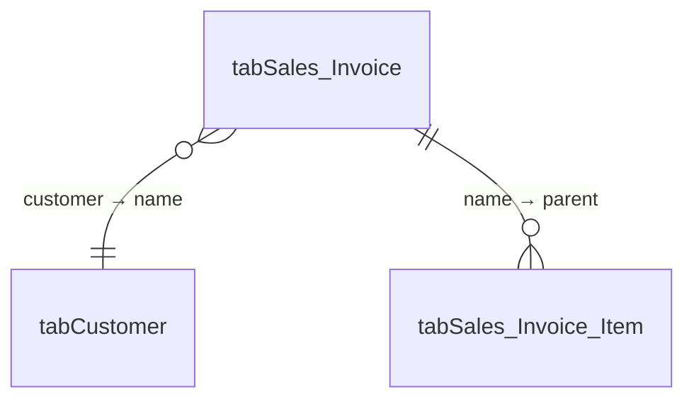

# MCP Server for Frappe Insights — Implementation Design (v3)

**Status:** Design proposal, revised after two adversarial reviews and after adopting the official `frappe_mcp` package · **Target:** Insights 3.11.2 on Frappe 16.29.0 (`version-3` branch) · **Scope:** v3 doctypes only

**Verification convention used throughout this document:** every factual claim carries a file path and line number that I opened during a revision. Claims I could *not* settle in code are tagged `⚠️ UNVERIFIED:` inline. If a statement has neither a citation nor the tag, treat that as an editing bug and challenge it.

Upstream citations of the form `frappe_mcp/server/server.py:136` refer to [`github.com/frappe/mcp`](https://github.com/frappe/mcp) at commit **`11d5076b1bf4483b2ff6751a13e0736f5396b1e6`** (`main`, 2026-05-29, `__version__ = 0.1.1`), which is the tree I read line by line for this revision.

---

## 0. Changelog

### 0.A Changes from v2 — the `frappe_mcp` discovery

After v2 was written, the project owner pointed us at [`frappe/mcp`](https://github.com/frappe/mcp) — an **official Frappe-org package** (`frappe_mcp`, MIT) that turns a Frappe app into a Streamable HTTP MCP server. I read the whole package at `main`. The headline:

| v2 said | v3 says | Where |
|---|---|---|
| The werkzeug-`Response` escape from `{"message": …}` is a mechanism I inferred from `frappe/handler.py:57`. | **Confirmed by working upstream code.** `MCP.register()` wraps a handler in `frappe.whitelist()` and its inner `wrapper()` returns a `werkzeug.wrappers.Response` (`server.py:8, 85, 108-119`). This is now a *verified* pattern in production use, not a clever reading. The `⚠️ UNVERIFIED` framing around it is **removed**. | §3.1 |
| Hand-build the JSON-RPC dispatcher, `initialize`, session ids in Redis, 202/405 handling: **700–1000 LOC, 3–4 days**. | **Deleted.** Upstream supplies all of it. Our transport shrinks to a ~60-line whitelisted wrapper plus an Origin guard. Re-estimated in §3.11 and §10. | §3 |
| `protocol.py` (framing, sessions) is a Phase 1 deliverable. | **File deleted from the plan.** So is the Redis session store — the MCP spec makes `Mcp-Session-Id` optional and upstream is stateless, which is a legitimate conformant shape. | §3.5, §10 |
| Tools are registered in a home-grown registry; `tools/list` is served by our code. | Tools are `@mcp.tool(...)`-decorated Python functions; `tools/list` and `tools/call` are upstream. Every tool in §4 is restated in that idiom. | §3.9, §4.0 |
| MCP resources are a "human-facing bonus" (rung 5 of the §5.4 delivery ladder). | **`frappe_mcp` does not implement resources at all** (`server/handlers.py:39-56` — every `resources/*` handler raises `NotImplementedError`). Rung 5 is **deleted as blocked-upstream**. Because v2 had already demoted it to decorative, the cost of losing it is approximately zero. This is a *validation* of the v2 decision, not a new problem. | §5.4 |
| (not considered) | Upstream **does** support prompts (`server/prompts/`, added 2026-05-29) even though the README's Limitations section still says it does not. Prompts are a user-invoked affordance, so they belong in the same "human-facing bonus" bucket resources occupied. Scoped as one optional Phase 2 item. | §5.7 |
| `errors.py` maps Insights exceptions to a `tools/call` result with `isError: true`. | **Upstream already does exactly this** — `tools/handlers.py:38-43` catches every `Exception` from a tool and returns `CallToolResult(isError=True)`. v2's error-recovery loop survives intact. There is one wrinkle (the message gets a fixed prefix, and *raising* is the only way to set the flag), specified in §3.7. | §3.7, §4.4 |
| Origin validation is rule 3 of the transport contract we write. | **Upstream performs no header inspection of any kind** — verified by grep over every `.py` in the package. Origin validation is therefore **ours to build**, and it is not optional. Specified precisely in §3.4. | §3.4 |
| `structuredContent` + `outputSchema` "when a client supports it". | Partially available and with a token cost v2 did not anticipate. `structuredContent` is emitted automatically for dict-returning tools, but the *same JSON is also written into the text block*, so a dict return costs roughly double. `output_schema` is hard-coded to `None` by `@mcp.tool` and can only be set by bypassing the decorator. §4.3's guidance changes accordingly. | §3.8, §4.3 |
| (not considered) | **`frappe_mcp`'s dependency pins are incompatible with Frappe v16 and a plain `pip install` silently downgrades the WSGI layer Frappe serves every request through.** Open upstream issue #5, unfixed. This is a hard install blocker with a known workaround. | §3.10 |
| (not considered) | Single primary maintainer, 31 commits, last push ~3 months ago, PyPI a year stale, no releases past `v0.1.0`. A real dependency-risk section with a pin-to-git-ref recommendation and a fork exit. | §3.10 |

**Unchanged and carried forward intact:** §5 (documentation layer, minus rung 5), §6 (`QuerySpec` + compiler), §7 (charts and the render port), §8 (permissions), §9 (share-token fix). None of them touch the transport. **The chart-config → Python port (§7.2) is still the real long pole** — that fact is now *more* visible, because the transport work that used to sit next to it in Phase 1 has evaporated.

### 0.B Changes from v1 — what was wrong (retained from v2)

Two adversarial critiques raised 23 gaps and 24 unverified claims. I went and read the code. Here is the honest accounting.

### v1 was wrong about these — fixed in v2

| # | v1 claimed | Reality (verified) | Where fixed |
|---|---|---|---|
| 1 | "One whitelisted POST handler, JSON in and out. No fighting Werkzeug." | Half wrong. A returned **dict** gets wrapped: `frappe/handler.py:62` does `frappe.response["message"] = data` and `frappe/utils/response.py:157-167` `as_json()` serializes the *whole* `frappe.local.response`. And `def handle(payload)` receives `None` — `frappe/app.py:326-347` `make_form_dict` parses a JSON body into `form_dict` **top-level keys**. **But the escape hatch is real**: `frappe/handler.py:57` returns a `werkzeug` `Response` untouched, and `frappe/api/__init__.py` does the same check again on the outer path. v1 never named the mechanism, so the design as written would not have connected. **v3 update: this is now independently confirmed by `frappe_mcp`, which is built on exactly this mechanism** (`frappe_mcp/server/server.py:108-119`). | §3 |
| 2 | "Permissions are free — we write no permission code at all." | False precisely where it matters. `run_query` executes a **transient** doc, so no `check_permission` and no `permission_query_conditions` hook ever fires. The only remaining gate is `check_table_permission`, called at `insights_table_v3.py:143` — and it returns `True` immediately when `Insights Settings.enable_permissions` is falsy (`insights_team.py:267-270`), which is the default (`insights_settings.json` has **no default** on that field), **and again for anyone holding `Insights Viewer`** (`insights_team.py:276-277`). | §8, rewritten |
| 3 | "Publicness cascades through `is_public_dashboard`, so token validation is inherited with no further edits." | False. `insights/api/shared.py:74-97` `get_public_charts()` reads `Dashboard.is_public == 1` in raw query-builder SQL and **never calls** `is_public_dashboard()`. There are in fact **three** independent guest predicates, not one — and a fourth bypass (`has_valid_preview_key`, `shared.py:57-60`) that short-circuits all of them. | §9, redesigned |
| 4 | The Python chart-render port spec (operations + `page_size`). | Missing `use_live_connection`. `chart.ts:90` copies it from the source query onto the data_query; `set_data_query` (`insights_chart_v3.py:68-78`) creates the data_query with only `{doctype, workbook}`, and `use_live_connection` has default `'0'` (`insights_query_v3.json`). So the port as specified forces the whole upstream pipeline into warehouse mode and silently returns zero rows. | §7.2, §11 |
| 5 | "`validate_query` is a zero-cost dry run"; "Phase 1: no writes to the database at all." | Both false. `build()` resolves tables through `get_ibis_table`, which for an un-imported warehouse table calls `enqueue_import()` + a live remote schema fetch + `CREATE TEMP TABLE` (`data_warehouse.py:319-332`). `apply_pivot` runs an eager `.execute()` mid-build (`ibis_utils.py:572`). Every execution inserts an `Insights Query Execution Log` row (`insights/utils.py:141-150`, called unconditionally at `ibis_utils.py:1005-1010`). | §6.4, §10 |
| 6 | "The compiler adds the `cast`" (the flagship before/after example). | Asserted with no rule anywhere. `QuerySpec` had no `cast` field and no inference rule. | §6.3 (rule now stated precisely and golden-tested) |
| 7 | "The import path does not run `set_data_query`/render." | Wrong reason. `restore_workbook_contents` calls `new_chart.insert()` (`insights_workbook.py:~125`), which runs `before_save → set_data_query()`. The data_query **is** created; only its `operations` are unpopulated. The remedy (post-import render loop) survives; the stated reason would have misled the implementer into hand-creating data_query rows. | §7.4 |
| 8 | "Every change to `items` enqueues an external preview-image job." | Overstated. `enqueue_update_dashboard_preview` returns early when `is_new()`, when there is no `get_doc_before_save()`, and under `frappe.flags.in_patch` (`insights_dashboard_v3.py:121-123`); `update_dashboard_preview` then no-ops when `items` is unchanged (`:139-140`). Batching is still good hygiene, but it is not a storm risk. | §11 |
| 9 | `frappe.local.insights.db_connections` | The accessor is `insights.db_connections`, a module `__getattr__` over `frappe.local.insights_db_connections` (`insights/__init__.py:37-43`). | §2 |
| 10 | Startup handshake asserts `is_user \|\| is_admin`. | Rejects a legitimate read-only viewer. `get_user_info` computes `is_viewer` **exclusively** — `"is_viewer": is_viewer and not is_admin and not is_user` (`insights/api/__init__.py:53`) — while `check_role` admits `Insights Viewer`. | §8.1 |
| 11 | Sankey "renders blank" and must be refused. | The stated failure mode is wrong. `validateConfig` has no Sankey branch (`chart.ts:94-204`) so it passes, and `addChartOperation` (`chart.ts:220-244`) has no Sankey branch either, so the data_query is source + filters + order_by over raw columns. A Sankey whose source query already emits source/target/value renders correctly. The *policy* of requiring explicit config is still defensible; the justification was fabricated. | §7.3 |
| 12 | `get_data_source_table_columns` is `@site_cache` with 24h staleness. | It is `@site_cache` with **no TTL** (`api/data_sources.py:355`). `get_schema` is the one with `ttl=24*60*60` (`:445`). `site_cache` is per-worker-process, so invalidation semantics differ from what v1's resource table asserted. | §6.5 |
| 13 | "An external client pays 4 connection handshakes; in-process pays one." | Bogus. Connections are cached per **Frappe request** and torn down by the `after_request` hook (`hooks.py:85`); each MCP `tools/call` is its own HTTP request. The saving comes from *composite tool design*, available to an external server too. | §2 |
| 14 | Claude Desktop remote MCP via `Authorization: token k:s` header. | Desktop's remote path is Connectors (OAuth). Static headers are a Claude Code capability. | §2.3 |
| 15 | Phase 3 OAuth is "the single biggest schedule risk"; DCR support "unverified". | **Reversed by inspection — see below.** | §3.6 |
| 16 | `restore_workbook_contents` remaps dashboard links. | It remaps `item["chart"]` and `item["links"]` only. **`range_links` is untouched** (`insights_workbook.py:~145-166`), so every `AsOfDate` filter built through `build_workbook` lands dead. It also drops malformed links with a bare `continue`, and `KeyError`s on `dashboard["items"]` if absent. | §7.5 |
| 17 | The Phase-3 `?t=` token read via `frappe.form_dict.get("t")`. | Dead branch. `is_public_dashboard` runs inside `/api/method/insights.api.get_doc` calls, not during page render, so a browser-URL query param is not in that request's `form_dict`. Header-only. | §9.3 |

### The single biggest new finding — Phase 3 OAuth is nearly free

v1 called browser-Claude support "the single biggest schedule risk" because Frappe's OAuth capabilities were unaudited. I audited them. **Frappe 16 ships a complete, MCP-ready OAuth 2.1 resource-server stack, and every relevant switch is on by default:**

- **RFC 9728 protected-resource metadata** at `/.well-known/oauth-protected-resource` — `frappe/integrations/oauth2.py:294, 429-481`.
- **RFC 8414 authorization-server metadata** at `/.well-known/oauth-authorization-server` — `oauth2.py:289, 300-346`, advertising `code_challenge_methods_supported: ["S256"]` (PKCE) and `token_endpoint_auth_methods_supported: ["none", "client_secret_basic"]` (so public clients work).
- **RFC 7591 dynamic client registration** at `/api/method/frappe.integrations.oauth2.register_client` — `oauth2.py:349-424`, advertised in the AS metadata only when enabled.
- **Automatic `WWW-Authenticate` challenge on 401/403** — `frappe/app.py:267-268` calls `set_authenticate_headers`, which emits `Bearer resource_metadata="<origin>/.well-known/oauth-protected-resource"` (`app.py:319-322`). This is exactly the probe modern MCP clients make.
- Defaults, from `oauth_settings.json`: `show_auth_server_metadata` = `1`, `show_protected_resource_metadata` = `1`, `enable_dynamic_client_registration` = `1`.
- Bearer-token auth is already wired into request handling: `frappe/auth.py:629-681` `validate_auth` → `validate_oauth` for `Authorization: Bearer …`, alongside `validate_auth_via_api_keys` (`:687-712`) for `Authorization: token k:s`.

**Consequence:** Phase 3's OAuth half collapses from "build an OAuth story" to "flip on `OAuth Settings`, confirm the `resource` URL matches the MCP endpoint origin, and return `401` from the transport so the framework attaches the challenge." That is hours, not weeks. It is reprioritised into Phase 2 in §10.

⚠️ **UNVERIFIED:** whether claude.ai's connector flow interoperates end-to-end with *this specific* Frappe implementation (scope handling, redirect-URI registration, consent screen) — that requires a live test against a running site, which I could not perform. The code is present and spec-shaped; interop is not proven.

### Critique claims I found to be WRONG or overstated on inspection

Being fair to v1 where the critics overreached:

1. **"No raw-JSON response type exists in `build_response()`'s map"** (Critique 1, gap [2]) — true but irrelevant, and it led the critic to under-rate the fix. The `Response` pass-through does not go through `build_response` at all. I verified it at **two** independent layers: `frappe/handler.py:57` (`if isinstance(data, Response): return data`) and `frappe/api/__init__.py` (`data = endpoint(**arguments); if isinstance(data, Response): return data`). Critique 2's proposed fix is correct and I have adopted it.
2. **"`from_cache` derived from `time_taken == -1` is unsound"** — not raised by either critic, but I checked it since it is load-bearing for `run_query`'s response. It is **correct**: `ibis_utils.py:979-980` returns `(cached_results, -1)` on a cache hit, and the execution path always overwrites `time_taken` with a real `flt` before returning (`:986-990`). v1 right.
3. **"Preview-image job storm"** (v1's risk, echoed uncritically) — real guards exist; see row 8 above. v1's mitigation is cheap so I kept it, but demoted it from "risk" to "hygiene".
4. **Critique 2's tool-count target of 13** is not reachable without either dropping read-back tools (which Critique 2 itself demands) or introducing action-dispatch tools (an anti-pattern for models). I land at **16 in the default surface** by collapsing four read-back tools into one `get_item`, and I say so rather than pretending.
5. **Critique 2 gap [11](b) "DCR is a convenience, not a blocker"** — right conclusion, understated reason. Frappe implements DCR natively and enables it by default (see above).

### What was new in v2

- **§3 Transport** — a dedicated section with the full Streamable-HTTP contract v1 omitted entirely (notifications → `202`, `GET` → `405`, `Origin` validation, `MCP-Protocol-Version` echo, `401` + `WWW-Authenticate`), and an honest size estimate. *(v3: the contract survives as the conformance checklist; the implementation is now mostly upstream.)*
- **§5 Per-data-source documentation layer** — a whole new subsystem: three provenance-separated zones, a Mermaid ERD generated from `insights_table_link_v3`, and — the part that actually matters — a delivery design that does not depend on MCP resources being read.
- **§4** tool surface trimmed and re-shaped; read-back, deletes, and dashboard mutation added.
- **§6** `QuerySpec` gains `having`, `cast`, `rename`, and a precisely specified auto-cast rule.
- **§8** a single mandatory choke-point helper for every transient `.execute()`.
- **§9** all three guest paths routed through one predicate.

Everything in v1's §3–§5 domain analysis that survived review is carried forward, corrected in place.

---

## 1. Executive summary

We are building an MCP server that lets Claude drive the Insights v3 domain model end-to-end — discover data sources and tables, read curated documentation about what those tables *mean*, compose and execute queries, build charts, assemble a dashboard, and return a shareable URL — without the user touching the query builder UI.

The server ships **inside the Insights app** as a new module `insights/mcp/`, runs **in-process under Frappe**, and is exposed as a **single whitelisted POST endpoint that returns a raw `werkzeug.Response`** — the verified escape from Frappe's `{"message": …}` envelope.

**The MCP protocol layer is not ours.** We adopt [`frappe_mcp`](https://github.com/frappe/mcp), the official Frappe-org package built on precisely that mechanism. It supplies the JSON-RPC dispatcher, `initialize`, `tools/list`, `tools/call`, notification handling and the `isError` mapping. What we still write is the Insights domain: the tools, the `QuerySpec` compiler, the chart-render port, the documentation layer, the permission choke point — plus one security control upstream omits (`Origin` validation, §3.4) and one dependency-hygiene workaround (§3.10).

Five load-bearing bets:

1. **We do not expose raw `operations[]` as the primary authoring surface.** The MCP layer defines a flat, LLM-shaped `QuerySpec` DSL that `insights/mcp/compiler.py` deterministically compiles into the 17-operation pipeline `IbisQueryBuilder` executes (§6).
2. **We port the client-side chart-config → data-query translation** (`frontend/src2/charts/chart.ts:220-380`) into Python, *including `use_live_connection` propagation*, because without it a headlessly-created chart renders blank (§7.2).
3. **We ground the model with a curated, provenance-separated documentation layer**, and we deliver it through the tools the model already calls rather than through MCP resources, which no Claude client auto-loads (§5).
4. **We route every guest-reachable path through one share predicate** so a revoked link is actually revoked (§9).
5. **We keep our contact surface with `frappe_mcp` down to four API points** (`MCP`, `@mcp.tool`, `ToolAnnotations`, `mcp.handle`) so that a stalled upstream costs us a vendored file, not a rewrite (§3.10).

---

## 2. Architecture decision

### 2.1 The three candidates

**(a) Python MCP server inside `insights/mcp/`, in-process with Frappe — recommended.**

The two decisive arguments, stated without padding:

- **We can call internals that are not whitelisted.** `IbisQueryBuilder`, `insights.warehouse.get_table`, `InsightsTableLinkv3.get_links` (`insights_table_link_v3.py:42`), `insights.query_utils.extract_table_deps_from_operations` — none need an HTTP shim.
- **The chart-render primitive has to live in this repo anyway** (§7.2). Once you are adding Python to Insights, "no repo changes" is not on the table, and the code belongs where the internals are.

A third, weaker argument: running after `frappe.set_user(<email>)` means `frappe.get_doc` / `frappe.get_list` inherit `insights/permissions.py`'s row-level model for the *persisted-document* tools. This is real but **narrower than v1 claimed** — it does not cover `run_query` (§8.2).

**Dropped from v1: the round-trip-latency argument.** Backend connections are cached per Frappe *request* and torn down by the `after_request` hook (`hooks.py:85` → `insights_data_source_v3.after_request`). Each MCP `tools/call` is its own HTTP request, so an in-process server pays the same per-call setup an external one would. The saving comes from *composite tool design* — bundling columns + joins + docs into one `describe_table` — which an external server could do just as well. The argument was padding, and padding invites a reviewer to re-litigate a decision that is correct on its own merits.

**Cons of (a), honestly:** couples MCP release cadence to `bench migrate`; a crash surfaces as a Frappe traceback; and it now also couples us to a third-party package with one maintainer (§3.10). v2 listed "the transport dispatcher is more work than v1 implied" as the third con — that one is **gone**, and it was the largest of the three.

**(b) Standalone external process over HTTP.** Rejected as *primary*. Composite operations become N round-trips; `@insights_whitelist()` interacts awkwardly with type coercion (see below); and the chart-render primitive still has to land in the repo, so the headline benefit evaporates.

> **Note on `@insights_whitelist()` and type coercion.** `insights/decorators.py:161-168` applies `@wraps(function)` outermost over `@frappe.whitelist()` over `@check_role(role)`, and `frappe.whitelist` runs `validate_argument_types(fn, …)` against the wrapper's `(*args, **kwargs)` signature (`frappe/__init__.py:461`). ⚠️ **UNVERIFIED:** whether `functools.wraps` setting `__wrapped__` causes `inspect.signature` to see through to the real signature and restore coercion. v1 asserted coercion is disabled; I could not settle it without running it. It does not affect design (a), which calls these functions in-process with correct Python types, so I have removed the claim rather than repeat it.

**(c) HTTP endpoint exposed by Frappe.** Not an alternative — it is the *transport* for (a). See §3.

### 2.2 Recommendation

> **Build (a), with (c) as its transport, and get (c) from `frappe_mcp` rather than hand-writing it. Use `npx mcp-remote` for local clients rather than hand-writing a stdio bridge.**

```
insights/mcp/
├── __init__.py       # mcp = MCP("insights"); handle_mcp() — the whitelisted entry point (§3.9)
├── origin.py         # Origin allowlist check — the one control upstream omits (§3.4)
├── validate.py       # @tool_args(schema): jsonschema-validate arguments; upstream does NOT (§3.6)
├── tools/            # one module per family; every function is @mcp.tool-decorated
│   ├── __init__.py   # imports every sibling so registration happens on first request
│   ├── discovery.py  ├── query.py   ├── docs.py
│   ├── workbook.py   ├── chart.py   ├── dashboard.py  ├── share.py
├── compiler.py       # QuerySpec  → operations[]           (§6)
├── chartspec.py      # ChartSpec  → chart config           (§7.1)
├── docs.py           # documentation layer: compose, ERD, staleness  (§5)
├── guards.py         # the single transient-execution choke point     (§8.3)
├── schemas.py        # explicit JSON Schemas, passed as input_schema= to every tool (§4.0)
├── prompts.py        # OPTIONAL, Phase 2 — @mcp.prompt human affordances (§5.7)
└── errors.py         # ToolError: frappe exception → isError tool result (§3.7, §4.4)
insights/insights/doctype/insights_chart_v3/chart_operations.py   # §7.2
insights/insights/doctype/insights_data_doc/                      # §5.2
```

**Deleted relative to v2:** `transport.py` and `protocol.py` (upstream), `server.py` (upstream registry), `resources.py` (unsupported upstream, and already demoted to decorative in v2 — §5.4). **Added:** `origin.py`, `validate.py`.

**Naming note.** `frappe_mcp`'s README shows a *module* `app/app/mcp.py`, giving the endpoint `/api/method/<app>.mcp.<handler>`. A **package** `insights/mcp/` resolves identically as long as the handler is defined in (or re-exported from) `insights/mcp/__init__.py`, because `frappe.whitelist` resolution walks the dotted path with `frappe.get_attr`. Endpoint: **`/api/method/insights.mcp.handle_mcp`**. Keep the package.

**Dropped from v1: `bin/insights-mcp-stdio`.** Critique 2 is right that this is avoidable work with subtle edge cases (never write to stdout outside the protocol; notifications must produce no response; protocol-version negotiation). `npx mcp-remote <url> --header "Authorization: token k:s"` already handles them. Document that instead. ⚠️ **UNVERIFIED:** `mcp-remote`'s exact current CLI flags — check its README at integration time; this is an external tool I cannot inspect from this repo.

### 2.3 Deployment shape (corrected)

| Client | Transport | Auth |
|---|---|---|
| Claude Code (local or remote) | direct remote HTTP, `--transport http --header` | `Authorization: token <key>:<secret>` (`frappe/auth.py:687-712`) |
| Claude Desktop | `npx mcp-remote` shim, **or** Connectors once OAuth is on | env-held API key via the shim; OAuth via Connectors |
| claude.ai in browser | remote HTTP | OAuth 2.1 — Frappe-native, see §3.6 |

⚠️ **UNVERIFIED:** whether the target bench is multi-tenant. If it is, `X-Frappe-Site-Name` is mandatory on every request (`frappe/app.py:~180` `init_request` reads it). This is a deployment fact, not a code fact.

---

## 3. Transport — integrating `frappe_mcp`

v1 hand-waved the transport. v2 specified it in full and budgeted 700–1000 LOC over 3–4 days. **v3 deletes almost all of that**, because `frappe_mcp` already implements it, and implements it on exactly the mechanism v2 identified.

This section is now an *integration* section. It answers four questions in order: what the mechanism is and why it is now verified (§3.1–3.2); what upstream gives us and what it does not (§3.3); the gaps we must close ourselves, one of which is a security control (§3.4–3.8); and how our code binds to it, what it costs, and what happens if upstream stalls (§3.9–3.11).

### 3.1 Why the naive version fails

1. **Response wrapping.** `frappe/handler.py:46-62`:
   ```python
   def handle():
       cmd = frappe.local.form_dict.cmd
       data = execute_cmd(cmd)
       if data is not None:
           if isinstance(data, Response):
               return data              # ← line 57: the escape hatch
           frappe.response["message"] = data   # ← line 62: the wrapper
   ```
   A returned dict lands under `message`, and `frappe/utils/response.py:157-167` `as_json()` serializes the **entire** `frappe.local.response` — including `_server_messages` injected by `make_logs()` (`:189-221`). That body is not a JSON-RPC envelope.

2. **Argument binding.** `frappe/app.py:326-347` `make_form_dict` parses a JSON request body straight into `frappe.local.form_dict` as top-level keys. `execute_cmd` then calls `frappe.call(method, **frappe.form_dict)` (`handler.py:87`), and `get_newargs` (`frappe/__init__.py:1168-1191`) drops every key that is not a named parameter. So `def handle(payload)` gets `payload=None`, and a real MCP client posts `{jsonrpc, id, method, params}` with no `payload` key at all.

### 3.2 The mechanism — no longer inferred

**Read the raw body; return a `werkzeug.wrappers.Response`.** The pass-through is confirmed at *two* layers of Frappe, so it holds for both routing paths (`/api/method/…` resolves through `frappe/api/v1.py:35-41` `handle_rpc_call` → `frappe.handler.handle()` → `frappe/api/__init__.py`, which itself re-checks `isinstance(data, Response)`).

**v2 tagged this as the design's single load-bearing inference. It is now verified by working upstream code.** `frappe_mcp`'s `MCP.register()` decorator wraps a function in `frappe.whitelist(...)`, and the wrapper it whitelists is annotated `-> Response` and returns `self.handle(request, response)` where `response = werkzeug.wrappers.Response()`:

```python
# frappe_mcp/server/server.py:108-119  (verbatim)
def wrapper() -> Response:
    fn()                                   # runs the decorated body first — see §3.9
    request = frappe.request
    response = Response()
    return self.handle(request, response)

return whitelister(wrapper)
```

`server.py:8` imports `Request, Response` from `werkzeug.wrappers`. `handle()` writes `response.data`, `response.mimetype` and `response.status_code` directly (`server.py:333-335, 373-375`) and never touches `frappe.local.response` — so `make_logs()` never runs against our payload and `_server_messages` cannot leak into the JSON-RPC envelope. **Remove the `⚠️ UNVERIFIED` framing wherever v2 hedged on this.**

### 3.3 What `frappe_mcp` provides, and what it does not

Read against v2's ten-rule Streamable-HTTP contract, which survives unchanged as the **conformance checklist**. Every row is verified against the tree at `11d5076`.

| v2 rule | Upstream status | Citation | Ours to do? |
|---|---|---|---|
| 1. JSON-only mode, never SSE | ✅ Provided. `response.mimetype = 'application/json'` on both the success and error paths. Tool streaming over SSE is an explicit non-feature. | `server.py:334, 374` | no |
| 2. `GET` → `405` | ✅ Provided. `if request.method != 'POST': response.status_code = 405`. **Partial:** no `Allow: POST` header is set. | `server.py:136-138` | header only |
| 3. `Origin` validation | ❌ **ABSENT.** Verified by grep for `headers`, `Origin`, `Accept`, `Session-Id`, `Protocol-Version` across every `.py` in the package: **zero hits**. `frappe_mcp` inspects no HTTP header at all. | — | **YES — §3.4** |
| 4. Notifications → `202`, empty body | ✅ Provided, and correctly: any method starting `notifications/` is routed to `handle_notification`, which returns `202` with no body and swallows validation errors rather than replying. | `server.py:145-146, 339-360, 383-385` | no |
| 5. JSON-RPC batch (array body) | ❌ Not handled — and worse than "not handled". `get_is_notification(data)` calls `data.get('method', '')` on the parsed body; an array has no `.get`, so a batch request raises `AttributeError` out of `handle()` and surfaces as a Frappe **500 traceback**, not a JSON-RPC error. | `server.py:145, 383-385` | see below |
| 6. `MCP-Protocol-Version` | ❌ Not negotiated, not read, not echoed. `handle_initialize` returns the string `'2025-03-26'` **hard-coded**, ignoring the client's requested `protocolVersion` entirely — `InitializeRequestParams.protocolVersion` is parsed and discarded. No request-header check on subsequent calls. | `server/handlers.py:4-20`; `types.py:72-76` | partial — §3.5 |
| 7. `Mcp-Session-Id` | ❌ Never issued, never validated. The server is fully stateless. | — | **no — §3.5** |
| 8. `401` + `WWW-Authenticate` | ⚠️ Neither provided nor prevented — it comes from **Frappe**, not `frappe_mcp`. Traced in §3.6. | `frappe/app.py:267-268, 319-322` | wiring only — §3.6 |
| 9. Insights failures → `isError: true` result | ✅ **Provided, and this is the good news.** `handle_call_tool` wraps the invocation in `try/except Exception` and returns `CallToolResult(content=[TextContent(...)], isError=True)`. v2's error-recovery loop is safe. One wrinkle in §3.7. | `tools/handlers.py:38-43` | wrinkle only |
| 10. `allow_guest` omitted | ✅ Supported (`register(allow_guest=False)` is the default), but see §3.6 — we deliberately invert this to get a spec-shaped `401` instead of Frappe's `403`. | `server.py:64-100` | decision — §3.6 |

**Also provided, beyond v2's checklist:** `ping`, `tools/list` (with `ToolAnnotations` serialization), `prompts/list` + `prompts/get`, pydantic-modelled JSON-RPC envelopes with the standard error codes, and a `frappe-mcp check` CLI that enumerates every app's MCP handlers and their tools (`--verbose` prints each `input_schema`) and prints the endpoint URL. That CLI is genuinely useful as a Phase 1 smoke test.

**Also absent, beyond v2's checklist:**

- **`resources/*`** — every handler raises `NotImplementedError` (`server/handlers.py:39-56`), which `server.py:326-327` converts to a `METHOD_NOT_FOUND` protocol error. `initialize` correctly does **not** advertise a `resources` capability (`handlers.py:12-19`), so a well-behaved client will not call them. See §5.4 for why this costs us nothing.
- **`completion/complete` and `logging/setLevel`** — same shape, same non-advertisement.
- **Argument validation.** This one matters. `tools/__init__.py:84-88` defines `run_tool()`, which jsonschema-`validate`s arguments against the tool's `input_schema` and filters unknown keys — but **`handle_call_tool` never calls it.** `_get_result` calls `fn(**arguments)` directly (`tools/handlers.py:49`). `run_tool` is dead code. Consequences, and our fix, in §3.6.

**On rule 5 (batch).** MCP revision 2025-06-18 **removed** JSON-RPC batching, and upstream declares `2025-03-26`, where it was optional. No current Claude client sends batches. We therefore accept the gap, but we add one defensive line in our wrapper — reject a non-`dict` parsed body with a clean `-32600 Invalid Request` — because a 500 traceback on an unexpected body shape is a bad failure mode regardless of who sends it. This closes v2's ⚠️ UNVERIFIED on batching: **the target revision does not permit it.**

### 3.4 The `Origin` gap — a security control we must build

**Verified absent.** `frappe_mcp` reads no request header of any kind. There is no allowlist, no `Host` check, no DNS-rebinding defence anywhere in the package. The MCP Streamable-HTTP specification is explicit that servers **MUST** validate the `Origin` header on all incoming connections, precisely because a locally- or intranet-reachable HTTP server that trusts the browser's ambient credentials is a DNS-rebinding target.

**Why Frappe does not already cover this.** `frappe/app.py:282-317` `set_cors_headers` reads `Origin`, but it is a *CORS response* mechanism, not a request gate: when the origin is not allowed it simply **omits** the CORS headers and lets the request proceed. Two failure modes follow:

1. **A DNS-rebinding attack does not need CORS.** The attacker's page rebinds a hostname it controls to the target's IP; the browser then believes the request *is* same-origin and CORS never engages. Only an explicit `Origin`/`Host` check stops it.
2. **`frappe.conf.allow_cors: "*"` is common in development benches**, at which point Frappe reflects any origin with `Access-Control-Allow-Credentials: true` and the endpoint is directly reachable cross-origin from any web page.

Neither is hypothetical for an endpoint whose whole purpose is to execute arbitrary analytical SQL against every connected data source under the caller's session (§8.2: on a default deployment that is *every table on the site*).

**Spec — `insights/mcp/origin.py`, called as the first thing in `handle_mcp()` after the auth check:**

```python
# insights/mcp/origin.py
from urllib.parse import urlsplit
import frappe

def origin_allowed(origin: str | None) -> bool:
    """MCP spec: validate Origin against DNS rebinding.

    Absent Origin  -> allowed. Non-browser callers (curl, mcp-remote, the
    Claude Code HTTP transport, server-to-server) send none, and a request
    with no Origin cannot be a rebinding attack, which is a browser attack.
    Present Origin -> must match the site's own origin, or be in the allowlist.
    """
    if not origin:
        return True

    allowed = {_norm(frappe.utils.get_url())}          # the site's own origin
    settings = frappe.get_cached_doc("Insights Settings")
    for line in (settings.get("allowed_origins") or "").splitlines():
        if line.strip():
            allowed.add(_norm(line.strip()))
    return _norm(origin) in allowed

def _norm(u: str) -> str:
    p = urlsplit(u if "://" in u else f"https://{u}")
    return f"{p.scheme}://{p.hostname}{':' + str(p.port) if p.port else ''}".lower()
```

Design decisions, each deliberate:

- **Reuse `Insights Settings.allowed_origins`.** The field already exists and already carries the operator's list of trusted embedding origins for the shared-dashboard `frame-ancestors` CSP (`InsightsPageRenderer`, §9.1). Adding a second, separate allowlist is how the two drift apart. Its semantics ("origins we trust to embed our dashboards") are a close enough match to "origins we trust to drive our MCP endpoint" that reuse is honest — but **say so in the field's description**, because we are widening what the field authorises.
- **The site's own origin is always allowed**, so a first-party in-page client works without configuration.
- **Absent `Origin` is allowed, and that is not a hole.** Every non-browser transport omits it, and a rebinding attack is by construction a browser attack. Refusing header-less requests would break `mcp-remote`, `curl`, and the Claude Code HTTP transport while buying nothing.
- **Refusal shape:** HTTP `403` with a JSON body `{"error": "origin_not_allowed"}`. Not a JSON-RPC error — this is a transport-layer refusal before any RPC is parsed, and the client should see a hard HTTP failure.
- **Also normalise `Host`.** ⚠️ **UNVERIFIED:** whether the target deployment terminates TLS at a proxy that rewrites `Host`. If the bench is multi-tenant, `frappe.utils.get_url()` already resolves per-site, which is the behaviour we want; confirm it at integration time.

**Tests (acceptance criteria, not nice-to-haves):**
1. No `Origin` header → `200`.
2. `Origin: https://evil.example` → `403`, and **no** tool ran (assert no `Insights Query Execution Log` row).
3. `Origin` equal to the site's own origin → `200`.
4. `Origin` listed in `Insights Settings.allowed_origins` → `200`.
5. `Origin` differing only in scheme or port from an allowlisted entry → `403` (catches a sloppy `startswith` regression).

**CI grep:** `origin_allowed(` must appear in `insights/mcp/__init__.py`. A future refactor that drops the call is the realistic way this control dies.

### 3.5 Session id and protocol version — what is missing, and whether we care

**`Mcp-Session-Id`: absent upstream, and we accept it.** The Streamable HTTP spec makes session ids **optional** — a server *MAY* assign one at initialization; a stateless server that assigns none is conformant, and clients must cope. `frappe_mcp` assigns none. **v2's rule 7 — "store session state in Redis (`frappe.cache`) keyed by session id, with a TTL" — is deleted.** It was solving a problem the spec does not require us to solve, and it was the second-largest line item in v2's transport estimate after the dispatcher itself. Our tools are stateless per call by design (every one takes explicit `data_source` / `workbook` / `name` arguments), so there is no session state to store. This is a simplification, not a compromise.

**`MCP-Protocol-Version`: absent upstream, partially our problem.**

- `handle_initialize` returns the literal `'2025-03-26'` regardless of what the client asked for (`server/handlers.py:9`). It does not fail on an unknown client version, it just answers with its own. Per spec the client then either accepts or disconnects. All current Claude clients accept `2025-03-26`.
- No `MCP-Protocol-Version` **request** header is read on subsequent calls, so a version mismatch after `initialize` produces **no error at all** — the server simply answers as if nothing were wrong. v2's rule 6 ("if present and unsupported, `400`") is unimplemented upstream and we are **not** implementing it: it protects against a scenario (client silently switching versions mid-session) that no client does, and doing it properly needs the session state we just decided not to keep.
- **We do echo it.** Our wrapper sets `MCP-Protocol-Version: 2025-03-26` on every response, matching what `initialize` actually returned. Hard-coding the same constant in two places is a smell, so `insights/mcp/__init__.py` reads it back from `frappe_mcp.server.handlers.handle_initialize({}, "insights")["protocolVersion"]` at import time rather than restating it. If upstream bumps the version, our header follows.

⚠️ **NEW UNVERIFIED:** whether Claude's Connectors flow (claude.ai) rejects a server advertising `2025-03-26` rather than `2025-06-18`. Claude Code and the MCP Inspector accept it. This is the single most likely upstream-caused interop failure and it is **the first thing to test in Phase 1** — the fix if it bites is a two-line monkeypatch of `handle_initialize`, or the fork in §3.10.

**One consequence worth naming.** `structuredContent` on a `tools/call` result is a **2025-06-18** feature, but upstream emits it (§3.8) while declaring `2025-03-26`. A strict client could reject the field. Another reason §4.3 now prefers plain-text returns.

### 3.6 Auth — tracing the `401`, and one deliberate inversion

**Where the challenge comes from: Frappe, not `frappe_mcp`.** `frappe_mcp` contains no authentication code and no `WWW-Authenticate` string — grep confirms zero occurrences. The full chain, verified in the local checkout (`frappe` 16.29.0):

1. `frappe/auth.py:629-681` `validate_auth` dispatches on the `Authorization` header: `Bearer …` → `validate_oauth` (sets the session user from a valid `OAuth Bearer Token`), `token k:s` / `Basic …` → `validate_auth_via_api_keys` (`:687-741`). This runs **before** our handler, so `frappe.session.user` is already correct.
2. If authentication fails or is absent, the request proceeds as `Guest`.
3. On the way out, `frappe/app.py:267-268`: `if response.status_code in (401, 403) and is_oauth_metadata_enabled("resource"): set_authenticate_headers(response)`.
4. `frappe/app.py:319-322` `set_authenticate_headers` attaches exactly:
   `WWW-Authenticate: Bearer resource_metadata="{get_resource_url()}/.well-known/oauth-protected-resource"`
5. `frappe/integrations/oauth2.py:294-295` serves that metadata document (RFC 9728) when the same flag is on; `:427-481` builds it.
6. The gate is `is_oauth_metadata_enabled("resource")` → `OAuth Settings.show_protected_resource_metadata` (`oauth2.py:483-500`), **default `1`**.

So: **we emit the status code, Frappe emits the header.** v2 rule 8's instruction — "do not hand-write the header" — is correct and confirmed.

**The inversion, and why.** v2 said to omit `allow_guest`, letting `is_whitelisted` (`frappe/__init__.py:479-492`) reject `Guest`. That works, but `is_whitelisted` raises `frappe.PermissionError`, which Frappe renders as **`403`**, not `401`. `app.py:267` attaches the challenge on `403` as well, so the header does arrive — but the MCP spec and the OAuth discovery flow both key on **`401`**, and a client that only probes for `401` will see a flat `403` and give up.

**Recommendation:** declare the endpoint `allow_guest=True` and make the *first executable statement* of `handle_mcp()` an explicit guest rejection returning `401`:

```python
if frappe.session.user == "Guest":
    return Response(status=401)      # frappe/app.py:267 attaches WWW-Authenticate
```

This is a deliberate trade: we move the authentication gate from the framework into one line of our own code. Compensating controls, all cheap:

- **CI grep**, treated as a build failure: the `Guest` check must be the first statement in `handle_mcp`, before `origin_allowed`, before any import of the tool modules.
- **A test** asserting an unauthenticated POST returns `401` **and** carries `WWW-Authenticate`, and that no tool executed.
- **A fallback** if the reviewer will not wear it: omit `allow_guest`, accept the `403`, and confirm by interop test whether Claude's connector flow actually starts from it. That is strictly safer and possibly sufficient — decide it with a live test, not an argument.

`xss_safe` is irrelevant to us either way: it only affects Frappe's own response sanitisation, which we bypass by returning a `Response`.

**OAuth setup (unchanged from v2 §3.5, still nearly free).** Turn on `OAuth Settings` (`show_protected_resource_metadata`, `show_auth_server_metadata`, `enable_dynamic_client_registration` — all default `1`); confirm `get_resource_url()` yields the same origin the MCP endpoint is served from; return `401`; done. `validate_oauth` reads `OAuth Bearer Token.scopes` (`auth.py:674`), so scope-gating a read-only toolset remains feasible. ⚠️ **UNVERIFIED (carried from v2):** end-to-end interop with claude.ai Connectors.

### 3.7 Tool errors — v2's strategy survives, with one wrinkle

**This was the highest-stakes question of the review, and the answer is favourable.** v2 §4.4 depends on Insights-side failures arriving as a *successful* `tools/call` result with `isError: true`, so the model can read `spec_path` + `valid_columns` and retry. A protocol-level error would break that loop, because clients frequently do not surface protocol errors to the model as readable text.

**Verified: `frappe_mcp` maps tool exceptions to `isError: true`, not to a protocol error.**

```python
# frappe_mcp/server/tools/handlers.py:38-43  (verbatim)
try:
    return _get_result(fn, arguments)
except Exception as e:
    error_content = types.TextContent(text=f"Error calling tool '{tool_name}': {e}")
    result = types.CallToolResult(content=[error_content], isError=True)
    return result.model_dump(exclude_none=True, by_alias=True)
```

An unknown tool name gets the same treatment (`:21-26`), which is arguably wrong per spec but is the forgiving direction. The whole `tools/call` result is then wrapped in a `JSONRPCSuccessResponse` with HTTP `200` (`server.py:331-336`). **No change to §4.4's strategy is required.**

**The wrinkle: `isError` can only be set by raising.** `_get_result` hard-codes `isError=False` on the success path (`tools/handlers.py:62-64`); there is no way for a tool that *returns* normally to flag an error. So:

> **Contract for every tool in `insights/mcp/tools/`:** signal a domain failure by `raise ToolError(<the full v2-shaped diagnostic>)`. Never return an error-shaped payload — it would come back with `isError: false` and the model would treat a failure as data.

```python
# insights/mcp/errors.py
class ToolError(Exception):
    """__str__ is the entire diagnostic. Upstream interpolates it into the
    isError text block via f"Error calling tool '{name}': {e}"."""
    def __init__(self, message, *, spec_path=None, operation_index=None,
                 valid_columns=None, fix=None, docs=None): ...
    def __str__(self) -> str:
        # renders exactly the v2 §4.4 shape: message / spec_path /
        # operation_index / valid_columns / fix / appended doc blocks
```

Two consequences, both acceptable:

1. **The text is prefixed** with `Error calling tool 'run_query': `. Cosmetic noise, ~8 tokens, and arguably helpful. We do not fight it.
2. **We cannot emit multiple content blocks or `structuredContent` on an error** — upstream builds a single `TextContent`. v2's error payload was a single text block anyway (§4.4), so nothing is lost. The doc-block appending for failed queries (§5.4, rung 1) becomes text appended to the same block.

**One real hazard upstream introduces.** Because `handle_call_tool` **swallows** the exception, Frappe's normal "roll back the transaction on an unhandled exception" path never runs — the request completes with status `200` and Frappe commits at the end of the request. A write tool that fails halfway can therefore leave a partial write **committed**. Fix, and it is mandatory:

> Every **write** tool wraps its body in `try/except: frappe.db.rollback(); raise`. Enforced by a CI grep over `insights/mcp/tools/{workbook,chart,dashboard,share,docs}.py`, or more robustly by a `@transactional` decorator applied under `@mcp.tool` that all write tools carry.

This is a genuine bug class that v2's hand-rolled dispatcher would not have had, because v2 controlled the `except` clause. Worth stating plainly.

**Prompts differ.** `prompts/get` errors *are* protocol errors — `handle_get_prompt` raises `ValueError` (`prompts/handlers.py:38, 53-56`), caught at `server.py:324-325` and returned as `INVALID_PARAMS`. Only relevant if we ship §5.7.

### 3.8 `structuredContent` and `outputSchema` — half-supported

Both were flagged in the brief. The answers differ.

**`structuredContent`: emitted, automatically, and it doubles your tokens.** `_get_result` (`tools/handlers.py:46-66`) does:

```python
tool_result = fn(**arguments)
content = types.TextContent(text='')
if isinstance(tool_result, str):
    content.text = tool_result
structured = None
try:
    content.text = content.text or json.dumps(tool_result)
    if isinstance(tool_result, dict):
        structured = tool_result
except Exception:
    content.text = content.text or str(tool_result)
```

- A tool returning a **`str`** → `content.text = <the string>`, `structuredContent = None`.
- A tool returning a **`dict`** → `content.text = json.dumps(dict)` **and** `structuredContent = dict`. The identical payload is serialized twice into one response.
- A tool returning a `list` or anything else → `json.dumps` into text, no `structuredContent`.

`CallToolResult` carries the field (`types.py:271-276`) and `model_dump(exclude_none=True)` emits it, so it does reach the client. But **v2 §4.3's plan — "return a compact markdown table *and* emit `structuredContent` so rich clients render natively without the model paying for both" — is not achievable here.** Upstream gives you both-or-neither, of the same JSON. §4.3 is updated: **our tools return `str`**.

**`outputSchema`: present in the type, unreachable through the decorator.**

- `Tool` (the `TypedDict`) has an `output_schema` field (`tools/__init__.py:23-29`), and `get_validated_tool` maps it to `outputSchema` and emits it in `tools/list` when non-`None` (`tools/handlers.py:86-98`) — the wire type carries it too (`types.py:290-295`).
- **But `get_tool()` hard-codes `output_schema=None`** (`tools/__init__.py:78`), and `ToolOptions` (`:40-45`) has no `output_schema` key. So **`@mcp.tool(...)` can never set it.**
- The only route is to bypass the decorator: build a `Tool` dict by hand and call `mcp.add_tool(Tool(name=…, description=…, input_schema=…, output_schema=…, annotations=…, fn=…))`.

**Recommendation: do not use `outputSchema` in Phase 1.** Declaring it obliges clients to validate `structuredContent` against it, and we have just decided not to emit `structuredContent`. Revisit only if a client-side rendering requirement appears, and then via `add_tool` for those specific tools.

### 3.9 How our code binds to `frappe_mcp`

**Do not use `@mcp.register()`.** It works, but it costs control for no benefit. `register()`'s `wrapper` calls our function purely for its import side-effects and **discards its return value** (`server.py:112`), so a decorated body cannot return a `403` or a `401` — it can only raise, which surrenders the status code to Frappe's exception mapping. It also hard-codes `methods=['GET', 'POST']` and adds no response headers.

**Use `mcp.handle(request, response)` directly.** It is public, documented API — the README presents it as the integration point "for any Werkzeug based server" — and it is the same call `register`'s wrapper makes. This keeps our total contact surface with `frappe_mcp` at **four symbols**: `MCP`, `@mcp.tool`, `ToolAnnotations`, `mcp.handle`. That number is the whole §3.10 exit strategy.

```python
# insights/mcp/__init__.py
import frappe
from werkzeug.wrappers import Response
from frappe_mcp import MCP, ToolAnnotations                 # noqa: F401 (re-export)
from frappe_mcp.server.handlers import handle_initialize

from insights.mcp.origin import origin_allowed

mcp = MCP("insights")

# Read the version upstream actually answers with, rather than restating it (§3.5)
PROTOCOL_VERSION = handle_initialize({}, "insights")["protocolVersion"]


@frappe.whitelist(allow_guest=True, methods=["POST", "GET"])
def handle_mcp():
    # 1. Auth gate FIRST. allow_guest=True is deliberate (§3.6) and this line is
    #    what makes it safe. CI-grepped as the first statement.
    if frappe.session.user == "Guest":
        return Response(status=401)          # frappe/app.py:267 adds WWW-Authenticate

    # 2. DNS-rebinding gate — upstream has none (§3.4)
    if not origin_allowed(frappe.request.headers.get("Origin")):
        return Response('{"error":"origin_not_allowed"}', status=403,
                        mimetype="application/json")

    # 3. Method gate — upstream 405s but sets no Allow header (§3.3 rule 2)
    if frappe.request.method != "POST":
        return Response(status=405, headers={"Allow": "POST"})

    # 4. Registration. Importing the tools package runs every @mcp.tool decorator.
    #    Idempotent: add_tool writes into an OrderedDict keyed by name.
    import insights.mcp.tools  # noqa: F401

    # 5. Defensive: upstream AttributeErrors on a non-dict body (§3.3 rule 5)
    if not isinstance(frappe.request.get_json(force=True, silent=True), dict):
        return _rpc_error(None, -32600, "Invalid Request: expected a JSON object")

    frappe.flags.insights_mcp_write = True   # §5.2 doctype-level zone guard
    resp = mcp.handle(frappe.request, Response())
    resp.headers.setdefault("MCP-Protocol-Version", PROTOCOL_VERSION)
    return resp
```

**Tool registration.** Each tool module does `from insights.mcp import mcp` and decorates:

```python
# insights/mcp/tools/discovery.py
from insights.mcp import mcp
from insights.mcp.schemas import DESCRIBE_TABLE_SCHEMA
from frappe_mcp import ToolAnnotations
```

Registration happens at **import** time, and the import happens inside `handle_mcp` (step 4) rather than at module top level, so a Frappe worker that never receives an MCP request never pays for it. Note `frappe_mcp` uses a plain module-level `OrderedDict` per `MCP` instance (`server.py:59, 217`), so registration is per-worker-process and re-runs on every worker restart — stateless and safe.

**The argument-validation gap we must close.** As established in §3.3, upstream's `run_tool` (which would have jsonschema-validated and key-filtered) is dead code; `_get_result` calls `fn(**arguments)` raw. Therefore:

- An **unknown key** in `arguments` → `TypeError: unexpected keyword argument` → caught → `isError` with an unhelpful Python message.
- A **missing required** argument → `TypeError` → same.
- A **wrong-typed** value (string where an integer is declared) → passed straight into our code.

None of this is fatal — everything still lands as `isError` rather than a crash — but the diagnostics are Python-shaped, not model-shaped, which is exactly what §4.4 exists to prevent. Fix:

```python
# insights/mcp/validate.py
def tool_args(schema: dict):
    """Validate arguments against the declared input_schema before the body runs.
    Upstream does not (frappe_mcp/server/tools/handlers.py:49 — run_tool is dead code)."""
    def deco(fn):
        @functools.wraps(fn)                       # required: get_input_schema/getdoc read the wrapped fn
        def inner(**kwargs):
            errs = sorted(Draft202012Validator(schema).iter_errors(kwargs), key=lambda e: e.path)
            if errs:
                raise ToolError(
                    "Invalid arguments.",
                    spec_path="/".join(str(p) for p in errs[0].absolute_path) or "<root>",
                    fix=errs[0].message,
                )
            return fn(**kwargs)
        return inner
    return deco
```

Applied **under** `@mcp.tool` so that the registration decorator sees the wrapper. Two notes: `functools.wraps` is required because `get_tool` reads `fn.__name__` and `getdoc(fn)` (`tools/__init__.py:58-59`); and every tool function should accept `**_ignored` so an extra key produces our schema error rather than a `TypeError` from Python. `jsonschema` is already an install-time dependency of `frappe_mcp` (`tools/__init__.py:7` imports it at module scope), so this adds nothing new — but see §3.10, because that import is load-bearing under `--no-deps`.

### 3.10 Dependency risk — stated bluntly

This is a young package with one maintainer, and the recommendation below is not a formality.

**The facts, all verified today (2026-08-19) against the GitHub API and the source:**

| Signal | Value |
|---|---|
| License | MIT (permits vendoring and forking without obligation) |
| Contributors | **2**: `18alantom` (31 commits), `tanmoysrt` (2). One primary maintainer. |
| Created / last push | 2025-06-24 / **2026-05-29** — ~**3 months** stale as of today |
| Stars / forks / open issues | 156 / 50 / 4 |
| Tags / releases | **one**: `v0.1.0`. `main` is `__version__ = '0.1.1'`, untagged, unreleased. |
| PyPI `frappe-mcp` | **0.1.0, uploaded 2025-07-07** — over a **year** behind `main` |
| HEAD | `11d5076b1bf4483b2ff6751a13e0736f5396b1e6` — *"feat: Add prompt support"* |
| README accuracy | **Stale.** Limitations still says "only supports Tools"; prompts landed at HEAD. |

**PyPI 0.1.0 is not an option, and the reason is concrete, not stylistic.** It predates the entire `frappe_mcp/server/prompts/` package (added at HEAD), and it predates whatever else moved between the `v0.1.0` tag and `0.1.1`. Anything we build against `main` and then deploy from PyPI would be a different codebase. **Pin to the git ref.**

**But a plain git install is *also* broken on our target, and this is the blocker to plan around.** Upstream issue **#5** (opened 2026-07-10, *after* the last push, **still open**) documents it and I verified both halves locally:

- `frappe_mcp/pyproject.toml` pins `Werkzeug==3.1.3` (exact) and `pydantic~=2.11.7`.
- `frappe/pyproject.toml:33,63` on our target pins `Werkzeug==3.1.6` and `pydantic~=2.12.5`.
- **The ranges do not overlap.** And because Frappe is installed editable, pip does not reconsider its requirements — so `pip install git+https://github.com/frappe/mcp` **silently downgrades the WSGI layer Frappe serves every request through**, with no warning.
- Second-order: `frappe/pyproject.toml:7` sets `requires-python = ">=3.14,<3.15"`, and `pydantic-core` 2.33.2 (what `pydantic~=2.11.7` resolves to) ships **no cp314 wheel** — only an sdist. So the downgrade also triggers a Rust build of `pydantic-core`, which fails on a stock bench.

The issue reporter ran upstream's own suite against Frappe v16's pinned versions — **67 passed** on Werkzeug 3.1.6 / pydantic 2.12.5 / Python 3.14 — so the pins are **not load-bearing**. The package imports only `Request`/`Response` from `werkzeug.wrappers` and `BaseModel`/`ValidationError` from pydantic, all stable across these versions. It is a packaging defect, not an incompatibility.

**Installation recommendation, in order of preference:**

1. **Fork `frappe/mcp` into the org, relax the two pins on a `frappe-v16` branch, and pin `insights/pyproject.toml` to that fork at a commit SHA.** Open the equivalent PR upstream and track issue #5. This is a one-line-per-pin diff, it is testable against upstream's own 67 tests, and it removes the silent-downgrade footgun entirely. **This is the recommendation.**
2. If a fork is unacceptable: `pip install --no-deps git+https://github.com/frappe/mcp@11d5076…` and satisfy the imports from the bench's existing environment. **Verify `jsonschema` is present** — it is *not* in `frappe/pyproject.toml`'s direct dependencies, and `frappe_mcp/server/tools/__init__.py:7` imports it at module scope, so `--no-deps` without it fails at import, not at call. `Click` is fine (Frappe pins `~=8.3.1`, upstream wants `>=8.1.8,<9`).
3. **Never** a bare `pip install frappe-mcp` or an unpinned git install.

In every case the `pyproject.toml` entry carries a **commit SHA**, never a branch name, so `bench update` cannot move the protocol layer underneath us.

**If upstream stalls — the exit, and its actual cost.**

Our contact surface is deliberately four symbols (§3.9): `MCP`, `@mcp.tool`, `ToolAnnotations`, `mcp.handle`. Everything else — the compiler, the chart port, the docs layer, the guards, every tool body — is ours and imports nothing from `frappe_mcp`. So:

- **Vendoring** is `cp -r frappe_mcp/server insights/mcp/vendor/` plus one import line change. The package is **~1,300 lines** across nine files with three third-party imports (werkzeug, pydantic, jsonschema), all of which the bench already has. MIT permits this without obligation beyond retaining the licence. **This is a half-day, not a project.**
- **Replacing** it with the official `mcp` Python SDK, or with v2's hand-rolled dispatcher, means rewriting `handle_mcp` and swapping the decorator — the ~700–1000 LOC v2 budgeted. That is the true worst case, and it is bounded because it is exactly the work v3 is deleting. **We are not betting anything we cannot rebuild.**
- **What we would lose in either case:** nothing in §5–§9. The domain design is transport-agnostic by construction.

**Standing decisions, all cheap:**
1. Vendor the package outright if any of these fire: upstream goes >6 months without a commit; a security issue we report goes unanswered for 30 days; a Frappe major version breaks it and no fix lands within a sprint.
2. Do not build on `resources/*` or on any `NotImplementedError` handler — treat the currently-implemented surface as the contract.
3. Keep a single integration test that posts `initialize`, `tools/list`, `tools/call` and a notification against the real endpoint and asserts the wire shapes. That test is what tells us a `bench update` broke the protocol layer, and it is the same test we would run against a vendored copy.
4. Run `frappe-mcp check --app insights --verbose` in CI. It is upstream's own conformance checker and it costs nothing.

**Net assessment.** The dependency is young, thinly maintained, stale by three months, mispublished on PyPI, and has a known unfixed install conflict with our exact framework version. It is also official, MIT, small enough to read in an afternoon (I did), correct on the parts we depend on, and **replaceable for less than the work it saves**. Adopt it — with a forked pin, a SHA, an integration test, and a written trigger for vendoring. Do not adopt it casually.

### 3.11 Revised size estimate

v2 budgeted the transport at **700–1000 LOC and 3–4 days**. What is actually left:

| Item | LOC | Notes |
|---|---|---|
| `insights/mcp/__init__.py` — `handle_mcp` wrapper | ~60 | §3.9, including all four gates |
| `insights/mcp/origin.py` — Origin allowlist | ~35 | §3.4 |
| `insights/mcp/validate.py` — argument validation decorator | ~30 | §3.6 |
| `insights/mcp/errors.py` — `ToolError` renderer | ~70 | mostly the diagnostic formatting v2 already specified |
| Transport tests (401 + header, 403 origin ×5, 405 + Allow, notification → 202, initialize round-trip, batch → invalid request) | ~180 | the §3.4 acceptance criteria plus v2's |
| Fork + relax pins + verify against upstream's suite | — | §3.10, ~2 hours |

**≈ 200 LOC of implementation and ~180 of tests, and roughly 1 day** — call it **1.5 days** with the dependency work and the first live client handshake. Against v2's 3–4 days that is a saving of **2–3 days**, and — more valuable — it removes the single riskiest hand-written component from the critical path, because the JSON-RPC framing is now code that other people are already running.

**The saving is real but it is not the schedule.** It buys back roughly half of Phase 1's slack. **The long pole is unchanged: the chart-config → Python port (§7.2), in Phase 2.** Nothing in this discovery touches it.

---

## 4. Tool catalog

### 4.0 How the catalog is expressed in `frappe_mcp`'s idiom (NEW in v3)

The 16-tool surface below is unchanged in *content*. What changed is that a tool is no longer an entry in a registry we wrote — it is a decorated Python function, and `tools/list` / `tools/call` are upstream's.

#### The `input_schema` decision: always explicit, never inferred

`frappe_mcp` supports both. `@mcp.tool()` with no `input_schema` infers one from the function signature; passing `input_schema=` uses yours verbatim. I read `frappe_mcp/server/tools/tool_schema.py` (208 lines) in full to decide.

**What the inference actually does** (`get_input_schema`, `tool_schema.py:117-168`):

- Walks `inspect.signature`, resolving forward refs with `get_type_hints`, skipping `*args`/`**kwargs`.
- Maps `int→integer`, `str→string`, `float→number`, `bool→boolean`, `None→null` (`:15-21`).
- Handles `Optional[T]` → `{"type": ["T", "null"]}`, `Union[…]` → `anyOf`, `list[T]` → `{"type":"array","items":…}`, `dict[K,V]` → `{"type":"object","additionalProperties":…}` (`:31-107`).
- Marks a parameter `required` iff it has **no default** (`:162-166`).
- Merges per-argument `description`s parsed out of a Google-style `Args:` docstring block (`get_descriptions`, `:171-208`, wired at `tools/__init__.py:62-71`).

**What it cannot do — every one of which we need:**

| Needed | Inference |
|---|---|
| `enum` (`op`, `granularity`, `data_type`, `chart_type`, `visibility`, `type`) | ✗ — no `Literal`/`Enum` support; falls through `_convert_type_to_json_schema`'s final `return {}` (`:113-114`) |
| `default` values in the schema | ✗ — defaults affect `required` only; the value is never emitted |
| `maximum` / `minimum` (`page_size ≤ 10000`, `limit ≤ 100`) | ✗ |
| Nested object `properties` (`QuerySpec`, `ChartSpec`, `Filter`, join specs) | ✗ — a `dict` parameter becomes a bare `{"type":"object"}`; a `list[dict]` becomes `{"type":"array","items":{"type":"object"}}`. The entire DSL vanishes. |
| `$defs` / `$ref` (v2 §6.2's `Filter` shared by `where`/`where_any`/`having`) | ✗ |
| Per-field `description` on a *nested* field | ✗ — docstring `Args:` merging is one level deep, keyed on top-level parameter names |
| An unannotated parameter | becomes `Any` → `{}` → accepts anything, silently |

For a tool whose entire value is a precisely-shaped DSL, "the parameter is an object" is not a schema. **Decision: every tool passes an explicit `input_schema=` from `insights/mcp/schemas.py`.** Uniform, greppable, and identical to what v2 already specified — v2's `schemas.py` survives unchanged, it just gets handed to a different consumer.

**Two gotchas that follow, both verified:**

1. **An explicit `input_schema` suppresses docstring `Args:` merging.** `get_tool` computes the inferred schema, mutates *it* with the parsed descriptions, and only then does `input_schema = options.get("input_schema") or _input_schema` (`tools/__init__.py:66-71`). The descriptions are written into the object that gets discarded. **So every field description must live inside the schema dict.** This is fine — v2 wrote them there anyway — but a contributor who adds an `Args:` block and expects it to show up will be silently wrong. Note it in `schemas.py`'s module docstring.
2. **The declared schema is advisory.** Upstream never validates arguments against it (§3.6). Hence `@tool_args(SCHEMA)` under every `@mcp.tool`, and the schema constant is passed to both.

#### `description`: docstring, first section only

`get_tool` takes `options["description"] or getdoc(fn)`, then — unless `use_entire_docstring=True` — truncates at the first `Args:` line (`tools/__init__.py:59-64`). We want the whole thing (v2 §5.4 rung 3 puts the "call `get_docs` first" instruction and the expression grammar in tool descriptions), and we do not want an `Args:` block competing with the explicit schema. **Convention: write the full description in the docstring, no `Args:` section, and pass nothing.** `use_entire_docstring` then does not matter.

#### `ToolAnnotations`

`frappe_mcp` exposes the full set — `title`, `readOnlyHint`, `destructiveHint`, `idempotentHint`, `openWorldHint` (`tools/__init__.py:32-37`, wire type `types.py:282-288`) — and emits them in `tools/list` when non-`None` (`tools/handlers.py:92, 97-98`). v2 used only `readOnlyHint` and `destructiveHint`; v3 adds `title` (better client-side labels for free) and `idempotentHint` where it is honestly true.

#### Return type: `str`

Per §3.8, a `dict` return serializes the same JSON into both `content[0].text` and `structuredContent`. **Every tool returns a `str`** — a compact markdown rendering — and the 20 KB cap of §4.3 applies to it.

#### Three converted examples

**1. `describe_table` — the grounding workhorse (read-only, nested schema, doc blocks)**

```python
# insights/mcp/tools/discovery.py
from frappe_mcp import ToolAnnotations
from insights.mcp import mcp
from insights.mcp.validate import tool_args
from insights.mcp.schemas import DESCRIBE_TABLE

@mcp.tool(
    name="describe_table",
    input_schema=DESCRIBE_TABLE,          # explicit — inference cannot express this (§4.0)
    annotations=ToolAnnotations(
        title="Describe table",
        readOnlyHint=True,                # without this, clients prompt on every call
        idempotentHint=True,
        openWorldHint=True,               # reads a live external database
    ),
)
@tool_args(DESCRIBE_TABLE)                # upstream does not validate arguments (§3.6)
def describe_table(**kw) -> str:
    """Columns, joinable tables and curated documentation for one table.

    Call this before writing any query against a table you have not queried in
    this conversation. `joins: []` means UNKNOWN, not "no joins exist" — Insights
    only auto-discovers links for Frappe databases; for other sources the correct
    joins, if documented, appear in the DOCUMENTATION block.
    """
    # ... §4.5 body: get_data_source_table_columns + Insights Table Link v3 + docs.compose()
    return render_markdown(...)           # str, not dict (§3.8)
```

`DESCRIBE_TABLE` in `schemas.py` is verbatim v2 §4.5's JSON Schema — `data_source`, `table_name`, `include_joins`/`include_docs`/`include_preview` with their `default`s, none of which the inference could have produced.

**2. `run_query` — the DSL tool (explicit schema is non-negotiable here)**

```python
@mcp.tool(
    name="run_query",
    input_schema=RUN_QUERY,               # inlines the QuerySpec + Filter $defs (§6.2)
    annotations=ToolAnnotations(
        title="Run query",
        readOnlyHint=True,                # no documents are created — but see the docstring
        idempotentHint=False,             # writes an execution log; may enqueue a warehouse import
        openWorldHint=True,
    ),
)
@tool_args(RUN_QUERY)
def run_query(**kw) -> str:
    """Compile a QuerySpec and execute it, returning rows.

    Call get_docs(data_source) before your first query against a source. Queries
    written without it are frequently wrong in ways that look correct.

    Supply exactly one of: spec (preferred) | raw_operations | saved_query.
    dry_run returns SQL and output columns WITHOUT rows — it is NOT free: it may
    enqueue a warehouse import, run an eager execute for pivots, and it always
    writes an execution log row.
    """
    try:
        ...  # compiler.compile(spec) -> guards.execute_transient(...)
    except InsightsCompilerError as e:
        raise ToolError(                  # raising is the ONLY way to set isError (§3.7)
            f"Column '{e.column}' does not exist after the summarize step.",
            spec_path=e.spec_path,        # "sort[0].column"
            operation_index=e.op_index,
            valid_columns=e.symbol_table,
            fix="sort by an output alias, not a source column.",
            docs=docs.blocks_for(e.tables),   # §5.4 rung 1: docs on failure
        )
    return render_markdown(...)
```

Note `readOnlyHint=True` alongside `idempotentHint=False`. That is not a contradiction: `run_query` creates no *documents* (which is what the model's permission prompt is about) but is not side-effect-free (execution log, possible warehouse import). v2 §4.5 already made that distinction in prose; the annotations now carry it on the wire.

**3. `delete_item` — the destructive one (and the rollback contract)**

```python
@mcp.tool(
    name="delete_item",
    input_schema=DELETE_ITEM,
    annotations=ToolAnnotations(
        title="Delete item",
        readOnlyHint=False,
        destructiveHint=True,
        idempotentHint=True,              # deleting an already-deleted item is a no-op error
    ),
)
@tool_args(DELETE_ITEM)
@transactional                            # MANDATORY on every write tool — see §3.7
def delete_item(type: str, name: str, **_) -> str:
    """Delete a query, chart, dashboard or AI note. Workbooks cannot be deleted here.

    Deleting a chart also deletes its hidden data_query. Insights Workbook is
    deliberately absent: its on_trash force-deletes every query, chart, dashboard
    and folder inside it, which is a UI decision with a confirmation dialog.
    """
    ...
```

`@transactional` is the §3.7 requirement: `frappe_mcp` swallows tool exceptions to build the `isError` result, so Frappe's automatic rollback-on-unhandled-exception never fires and a half-finished write would commit at request end. The decorator wraps the body in `try / except: frappe.db.rollback(); raise`.

#### What the model-facing surface does *not* change

Tool names, argument names, response shapes, the 16-tool count, the read-only subset, `dry_run`, the token budget — all identical to v2. A client that worked against v2's hand-rolled server would work against this one unchanged. The adoption is invisible above the wire.

### 4.1 Design principles (revised)

1. **Composite over primitive.** `create_chart` inserts *and* renders *and* returns sample rows. The model should never learn that `data_query` exists.
2. **Names are grounded, never guessed.** Every tool taking a `table_name` or `column_name` has a discovery sibling that produced it, and errors return the valid candidates.
3. **Return the next step's inputs.** `run_query` returns `columns[]` with `data_type` and `role`, because that is exactly what `create_chart` needs.
4. **Ground *meaning*, not just names.** Discovery responses carry the curated documentation for what they describe (§5.4). This is the single biggest change from v1.
5. **Workbook ids are strings.** `Insights Workbook` is `autoname: autoincrement` (`insights_workbook.json`), so names are integers; the codebase itself `str()`-coerces. Every schema types `workbook` as `string`.
6. **Terse by default, verbose on request.** Token budget is a correctness concern, not an aesthetic one (§4.3).

### 4.2 The surface — 16 tools

No `insights_` prefix: clients already namespace as `mcp__insights__<tool>`. The **Annotations** column names the `frappe_mcp.ToolAnnotations` fields set on each tool (§4.0); every tool additionally carries a `title`.

| # | Tool | Annotations | Purpose |
|---|---|---|---|
| 1 | `list_data_sources` | `readOnlyHint` | sources + per-type naming notes + doc availability |
| 2 | `list_tables` | `readOnlyHint` | tables + `warehouse_ready` + one-line `purpose` from docs |
| 3 | `describe_table` | `readOnlyHint` | columns + joins + **documentation blocks** (+ optional preview) |
| 4 | `distinct_values` | `readOnlyHint` | real category values — **table mode or query mode** |
| 5 | `get_docs` | `readOnlyHint` | the documentation layer, tiered (§5) |
| 6 | `run_query` | `readOnlyHint` | compile + execute a `QuerySpec`; `dry_run` folds in v1's `validate_query` |
| 7 | `save_query` | — | persist a query; auto-creates a workbook if none given |
| 8 | `list_workbooks` | `readOnlyHint` | |
| 9 | `get_item` | `readOnlyHint` | read back a query / chart / dashboard / workbook |
| 10 | `create_chart` | — | insert + render + sample rows |
| 11 | `update_chart` | — | patch config; `rerender_only: true` covers v1's `render_chart` |
| 12 | `create_dashboard` | — | items + generated layout |
| 13 | `update_dashboard` | — | add/remove items, add filters, reflow — **one batched write** |
| 14 | `share_dashboard` | `destructiveHint` when `visibility == "public_link"` | delta-merge + blast-radius gate |
| 15 | `write_ai_note` | — | write to the AI-notes documentation zone **only** |
| 16 | `delete_item` | `destructiveHint` | query / chart / dashboard / ai_note — **never workbook** |

**Behind opt-in toolsets, not in the default surface:** `query_from_sql` (arbitrary-SQL surface) and `build_workbook` (§7.5). A read-only deployment exposes tools 1–6, 8, 9 — eight tools, all `readOnlyHint`.

**Consolidations relative to v1 (19 → 16), and what each cost:**

- `validate_query` → `run_query(dry_run: true)`. A separate validate tool gets skipped; a flag on the tool the model is already calling does not.
- `render_chart` → `update_chart(chart, rerender_only: true)`. Rendering is always-on inside create/update; the standalone form survives only for "the source query changed".
- `get_query` / `get_chart` / `get_dashboard` / `get_workbook` → one `get_item(type, name)`. This is the compromise that lets me add read-back without blowing the budget. The cost is a slightly less self-documenting schema; mitigated by per-type response documentation in the tool description.
- `get_share_state` → folded into `get_item(type: "dashboard")`.
- `share_workbook` → dropped from v1's surface. **Workbooks have no public-link mode at all**: `"Insights Workbook"` is absent from `public_doctypes` (`shared.py:6-10`), which makes the `if doctype == "Insights Workbook"` branch inside `is_public()` (`:23-24`) unreachable dead code. Workbook sharing is DocShare-only and is a UI concern.
- `create_workbook` → dropped; `save_query` creates one when `workbook` is omitted and returns its name.

**Explicitly *not* consolidated, against Critique 2's advice:** `run_query` keeps `spec`, `saved_query`, and `raw_operations` on one tool rather than splitting into `run_query` / `run_saved_query`. Splitting costs a tool slot I do not have. The `oneOf` **is** removed — the schema declares all three as optional with documented precedence (`spec` > `raw_operations` > `saved_query`), and supplying zero or more than one returns an `isError` result naming the conflict. Critique 2 is right that a top-level `oneOf` will not stop the model; an explicit runtime error with a fix hint will.

### 4.3 Token discipline

Critique 2 gap [3] is the most practically important non-security finding in either review. A `describe_table` on a wide ERP table can burn 8–15k tokens, and the headline flow needs several of them.

| Tool | v1 default | v2 default | Rationale |
|---|---|---|---|
| `describe_table.include_preview` | `true` | **`false`** | `get_data_source_table` returns `head(100)` (`api/data_sources.py:333`). When `true`, return **5 rows**, each cell truncated at 80 chars. |
| `run_query.page_size` | `100` | **`20`** | max stays `10000`; `execute_ibis_query` clamps to `1..10_000` anyway (`ibis_utils.py:953`) |
| `run_query.include_sql` | `true` | **`false`** | |
| `run_query.include_operations` | always echoed | **`false`** | `save_query` accepts the same `spec`, so the model rarely needs the compiled ops |
| `run_query.include_count` | `true` | **`false`** | it costs a second `get_count()` round trip |
| `list_tables.limit` | `50` | `50` | but fields trimmed to `{table_name, warehouse_ready, purpose}` |

**Response rendering — corrected in v3.** `rows` are returned as a compact markdown table in the text content, not an array of per-row JSON objects — roughly halves the tokens for narrow results. **v2 additionally proposed emitting `structuredContent` with an `outputSchema` "so rich clients can render natively without the model paying for both". That is not achievable on `frappe_mcp` and the plan is withdrawn.** Per §3.8, `_get_result` (`tools/handlers.py:46-66`) writes `json.dumps(result)` into the text block *and* sets `structuredContent` to the same object when a tool returns a `dict` — you get both, of the same payload, and the model pays for both. `output_schema` is separately unreachable through `@mcp.tool` (hard-coded `None` at `tools/__init__.py:78`).

> **Rule: every tool returns a `str`.** A `str` return leaves `structuredContent` unset (`tools/handlers.py:51-53`) and puts exactly our markdown on the wire. Revisit only if a specific client rendering requirement appears, and then via `mcp.add_tool` for those tools alone.

**Hard byte cap.** Every tool response is capped at **20 KB** of serialized content. On truncation the response carries an explicit, actionable hint rather than silently dropping data:

```json
{ "truncated": true,
  "truncated_at": "rows[14]",
  "hint": "Response capped at 20KB. Narrow with select[] to fewer columns, lower page_size, or request page 2." }
```

Silent truncation is worse than an error, because the model reasons confidently over a partial table.

### 4.4 Error semantics

**Reserve JSON-RPC errors for protocol, parse, and auth failures.** Everything else — a bad column name, a permission denial, a circular reference, a build failure — comes back as a **successful** `tools/call` result with `isError: true` and the diagnostic in the text content. A JSON-RPC protocol error is frequently not surfaced to the model as readable text, which turns the recovery loop into "model sees a generic failure, retries the identical call".

> **v3 — this strategy is confirmed compatible with `frappe_mcp`, and it was the review's biggest open risk.** `tools/handlers.py:38-43` catches every `Exception` from a tool and returns `CallToolResult(isError=True)` inside an HTTP-`200` JSON-RPC *success* envelope. It does **not** map tool exceptions to protocol errors. No workaround is needed. See §3.7 for the two mechanical consequences: **`isError` can only be set by raising**, so tools `raise ToolError(...)` rather than returning an error payload; and **upstream's swallowing of the exception defeats Frappe's automatic rollback**, so every write tool carries `@transactional`.

Payload shape (the text is `str(ToolError)`; upstream prefixes it with `Error calling tool '<name>': `):

```json
{ "isError": true,
  "content": [{ "type": "text", "text":
    "Error calling tool 'run_query': Column 'order_total' does not exist after the summarize step.\n"
    "spec_path: sort[0].column\n"
    "operation_index: 4\n"
    "valid_columns: order_month, sum_of_price, count_of_rows\n"
    "fix: sort by an output alias, not a source column." }] }
```

Note the single content block: `handle_call_tool` builds exactly one `TextContent` and sets no `structuredContent` on the error path, so the §5.4 rung-1 doc blocks appended on failure are appended *to this text*, not carried as a second block. v2's payload was one text block anyway.

**Error re-surfacing mechanics.** Build failures emit a realtime toast naming only "position N" (`ibis_utils.py:108-117`). `errors.py` catches, maps operation index N back to the *spec* field that produced it (the compiler retains that mapping), and emits the shape above. Exception discriminators to map: `frappe.PermissionError`, `frappe.ValidationError`, `CircularQueryReferenceError` (carries a human path string from `_validate_no_circular_dependency`, `insights_query_v3.py:84`), `TypeError` (from `@validate_type`, `insights/decorators.py:137-139`).

**Annotations.** `readOnlyHint: true` on tools 1–6, 8, 9 — without it, users get a permission prompt on every call, which kills multi-step flows in practice. `destructiveHint: true` on `delete_item` and on `share_dashboard` when `visibility == "public_link"`. All five annotation fields are available (`frappe_mcp.ToolAnnotations`, `tools/__init__.py:32-37`) and are serialized into `tools/list` when non-`None` (`tools/handlers.py:92, 97-98`).

⚠️ **NEW UNVERIFIED:** `share_dashboard`'s `destructiveHint` is conditional on an *argument value* (`visibility == "public_link"`), but `frappe_mcp` reads annotations once at registration and serves the same static object to every `tools/list` (`tools/handlers.py:86-98`). There is no per-call annotation. **Set `destructiveHint: true` unconditionally on `share_dashboard`** and keep the real gate where it belongs — the `confirm_public` blast-radius refusal in §9.3, which is a runtime check and cannot be bypassed by a client that ignores hints.

### 4.5 Selected tool specs

Only the tools whose shape changed materially from v1 are re-specified here; the rest carry forward.

#### `distinct_values` — now usable during discovery

v1 required an existing saved `query`, making it useless at exactly the moment the model needs real category values (before anything is saved). Note that `insights.api.data_sources.fetch_column_values` is **not** the answer: it calls `frappe.get_doc("Insights Data Source", …)` — the **legacy** doctype (`api/data_sources.py:229`).

```json
{ "type": "object",
  "properties": {
    "data_source": {"type":"string"}, "table_name": {"type":"string"},
    "saved_query": {"type":"string", "description":"alternative to data_source+table_name"},
    "column_name": {"type":"string"},
    "search": {"type":"string"},
    "limit": {"type":"integer","default":20,"maximum":100}
  },
  "required": ["column_name"] }
```

In table mode, compile a transient `QuerySpec` internally — `from` → `group_by:[{column}]` → `aggregate:[{fn:"count"}]` → `sort desc` → `limit` — and run it through the same transient-execution helper as `run_query` (§8.3). No new backend endpoint needed. **Return values with counts**, so the model can distinguish a dominant category from a long tail.

In query mode, call `InsightsQueryv3.get_distinct_column_values` (`insights_query_v3.py:292-330`, cached 24h).

#### `describe_table` — the grounding workhorse

```json
{ "type": "object",
  "properties": {
    "data_source": {"type":"string"}, "table_name": {"type":"string"},
    "include_joins":   {"type":"boolean","default":true},
    "include_docs":    {"type":"boolean","default":true},
    "include_preview": {"type":"boolean","default":false}
  },
  "required": ["data_source","table_name"] }
```

Calls `get_data_source_table_columns` (`api/data_sources.py:354-369`, live connection); joins via a direct `frappe.get_all("Insights Table Link v3", or_filters={left_table: X, right_table: X}, filters={data_source})` — **not** `get_table_links`, which requires *both* table names (`api/data_sources.py:381`) and cannot answer "what can I join to X".

**Normalizations** (the raw APIs are inconsistent): `get_data_source_table_columns` emits key `column`; `get_columns_from_schema` emits key `name` (`ibis_utils.py:1027-1034`). We always emit `name`. We add `role` by applying `FIELDTYPES` (`frontend/src2/helpers/constants.ts:11-19`): `Integer|Decimal → measure`, everything else → `dimension`. Note `get_columns_from_schema` returns only `{name, type}` — **there is no `is_measure` from the backend**; it is computed client-side, so we compute it too.

**Joins caveat, surfaced in the response.** `update_table_links` populates `Insights Table Link v3` **only** when `is_site_db or is_frappe_db` (`insights_data_source_v3.py:420-423`). For MariaDB / PostgreSQL / BigQuery / ClickHouse sources the table is empty unless a human created rows via `create_table_link`. So `joins: []` means **"unknown"**, not "none exist" — and it is precisely why the human documentation zone (§5) carries the correct-joins knowledge for those sources.

**Freshness caveat.** `get_data_source_table_columns` is `@site_cache` with **no TTL** and no known invalidation after `update_data_source_tables` (`api/data_sources.py:355`), and `site_cache` is per-worker-process. The response says `"column_freshness": "cached per worker, no TTL — call update_data_source_tables to refresh"` rather than asserting a staleness figure.

Response adds a `documentation` block (§5.4) and, when `include_docs` and the block is stale, the staleness warning (§5.5).

#### `run_query`

```json
{ "type": "object",
  "properties": {
    "spec":           {"$ref":"#/$defs/QuerySpec"},
    "raw_operations": {"type":"array","description":"ADVANCED escape hatch: raw v3 operations[]. Use only for union / custom_operation / deeply nested filter groups. Prefer spec."},
    "saved_query":    {"type":"string","description":"run an existing Insights Query v3 by name"},
    "dry_run": {"type":"boolean","default":false,
      "description":"Build the query and return SQL + output columns WITHOUT returning rows. NOT free — see description."},
    "workbook": {"type":"string"},
    "use_live_connection": {"type":"boolean","default":true},
    "page": {"type":"integer","default":1},
    "page_size": {"type":"integer","default":20,"maximum":10000},
    "force": {"type":"boolean","default":false,"description":"bypass the 10-minute result cache"},
    "include_sql": {"type":"boolean","default":false},
    "include_count": {"type":"boolean","default":false},
    "include_operations": {"type":"boolean","default":false}
  } }
```

Compiles `spec`, builds a **transient** doc, and executes it through the §8.3 choke point. Nothing is persisted: no `Insights Query Reference` rows, no circular-dependency validation, no background job.

**`dry_run` is honestly labelled.** v1 called this "zero-cost, zero database execution". It is neither:

- `build()` resolves sources through `InsightsTablev3.get_ibis_table`, which for an un-imported warehouse table calls `enqueue_import()` **and** `get_remote_table()` (a live connection) **and** `db.create_table(..., temp=True)` (`data_warehouse.py:319-332`).
- `apply_pivot` runs an eager `.execute()` mid-build to discover distinct column values, uncached (`ibis_utils.py:542, 572`).
- `apply_code` executes Python and materializes a temp DuckDB table at build time.
- Every real execution inserts an `Insights Query Execution Log` row (`insights/utils.py:141-150`, called at `ibis_utils.py:1005-1010`).

So: **the guarantee is "does not return rows", not "free".** The tool description says exactly that. `dry_run` **refuses** a spec containing `pivot_on` with a message explaining why, and refuses `raw_operations` containing `code` or `sql`. Where a warehouse table is involved, prefer `get_ibis_table(import_if_not_exists=False)` — that variant exists and throws a clear message instead of silently creating an empty temp table (`data_warehouse.py:333-336`). ⚠️ **UNVERIFIED:** whether that flag can be threaded through `InsightsTablev3.get_ibis_table`, which hard-codes `import_if_not_exists=True` at `insights_table_v3.py:148`; it likely needs a small signature change.

**Response:**
```json
{ "columns": [ {"name":"status","data_type":"String","role":"dimension"},
               {"name":"count_of_rows","data_type":"Integer","role":"measure"} ],
  "rows_markdown": "| status | count_of_rows |\n|---|---|\n| Open | 42 |",
  "returned": 7, "truncated": false, "from_cache": false, "time_taken": 0.41 }
```
`from_cache` is derived from `time_taken == -1` — **verified correct**: `ibis_utils.py:979-980` returns `(cached, -1)` on a hit, and the execution path always overwrites with a real `flt` (`:986-990`).

**Zero-row diagnosis.** When `rows == 0` and `use_live_connection` is false and the resolved table has `stored != 1`, append: `"probable_cause": "table not synced to the warehouse; an empty temp table was substituted. Retry with use_live_connection: true."` This is the cheapest defence against the system's worst failure mode (§11).

#### `get_item`

```json
{ "type":"object",
  "properties": {
    "type": {"enum":["query","chart","dashboard","workbook"]},
    "name": {"type":"string"},
    "include_spec": {"type":"boolean","default":true,
      "description":"attempt to decompile operations/config back into QuerySpec/ChartSpec"}
  },
  "required":["type","name"] }
```

- `query` → `operations`, `use_live_connection`, `is_native_query`, output columns via `get_columns_for_selection` (`insights_query_v3.py:332-335`), and a best-effort decompiled `spec`.
- `chart` → `chart_type`, `query`, `data_query`, full `config`, decompiled `ChartSpec`, last-rendered sample rows.
- `dashboard` → `items` with layout, plus the share state. **Caveat surfaced:** `people_with_access` and `is_shared_with_organization` are populated only when the caller has *write* permission (`insights_dashboard_v3.py:62-71`); a read-only identity gets nothing, and we report `"sharing_state_unavailable: caller lacks write permission"` rather than "not shared".
- `workbook` → `insights.api.get_doc("Insights Workbook", name)`; `as_dict()` returns `folders/queries/charts/dashboards` as **JSON strings**, which we parse. The returned `queries` list already excludes hidden chart `data_query` docs — reuse that filter rather than enumerating `Insights Query v3` directly.

**Decompilation is best-effort and labelled.** When the compiler cannot round-trip (raw operations the DSL cannot express), return `spec: null, spec_reason: "contains union — not expressible in QuerySpec"` rather than a lossy approximation.

#### `update_dashboard`

```json
{ "type":"object",
  "properties": {
    "dashboard": {"type":"string"},
    "add_items": {"type":"array"},
    "remove_item_ids": {"type":"array","items":{"type":"string"}},
    "add_filters": {"type":"array"},
    "reflow": {"type":"boolean","default":true}
  },
  "required":["dashboard"] }
```

Reads current `items`, merges, re-runs the layout generator over the merged list, and writes `items` **once**. The "now add a revenue-by-region chart to that dashboard" follow-up had no tool in v1, which meant the one-shot demo was the only flow that worked.

**Two hard invariants enforced:** every item must carry a `type` key or `set_linked_charts()` raises `KeyError` on the unguarded `item["type"]` subscript (`insights_dashboard_v3.py:80`); every item must carry `layout` with a **unique** `i`. Never write `linked_charts` — it is derived in `before_save`.

**Filter links hide the backtick format**, the most error-prone surface in the model. The layer:
1. Resolves each `chart` → its **source** `query` field (**not** `data_query`).
2. Emits `` links[chart] = f"`{query}`.`{column_name}`" `` — matching the server regex `^\`([^\`]+)\`\.\`([^\`]+)\`$` at `insights_dashboard_v3.py:105`.
3. For range filters emits `range_links[chart] = {start_column, end_column}` in the same format (`:111-112`).
4. Verifies the column exists on that query via `get_columns_for_selection()` before writing — a malformed link silently disables the filter *and* blocks `get_distinct_column_values` (`:91-95`).

#### `delete_item`

```json
{ "type":"object",
  "properties": { "type": {"enum":["query","chart","dashboard","ai_note"]},
                  "name": {"type":"string"} },
  "required":["type","name"],
  "annotations": { "destructiveHint": true } }
```

**`workbook` is deliberately absent.** `Insights Workbook.on_trash` force-deletes every query, chart, dashboard and folder in it, leaving only a JSON `data_backup` snapshot (`insights_workbook.py:31-46`). That is not a tool call, it is a UI decision with a confirmation dialog.

Deleting a chart cascades to its hidden data_query (`insights_chart_v3.py:45-46`), which is correct and worth stating in the description. Without deletes, a 20-turn session leaves a workbook full of garbage the model created and cannot remove — Critique 2 gap [5] is right that this is a real capability hole, and the §6-of-v1 argument for withholding deletes applies to `Insights Workbook` and only to it.

---

## 5. Per-data-source documentation layer (NEW)

Schema tells the model what columns *exist*. It does not tell it that `status = 'C'` means cancelled, that `tab_orders_legacy` was superseded in 2023, that `customer_id` on the invoices table is unreliable before 2021, or that joining orders to shipments on `order_ref` produces duplicates unless you also filter `is_current = 1`. That knowledge is what separates a query that runs from a query that is right, and no amount of schema introspection recovers it.

### 5.1 Three zones, separated by provenance

| Zone | Source | MCP-writable? | Trust | Storage |
|---|---|---|---|---|
| **Schema** | auto-generated from `insights_table_v3` + `insights_table_link_v3` | no | **fact** | not stored — generated on read, cached |
| **Documentation** | **manually uploaded by humans** | **no — read-only to the MCP server** | **authoritative** | `Insights Data Doc` rows, `zone = "Documentation"` |
| **AI notes** | written by Claude while exploring | **yes, this zone only** | inference, unverified | `Insights Data Doc` rows, `zone = "AI Note"` |

**Why manual upload rather than AI-drafted docs.** Provenance separation makes wrong queries debuggable: when a query comes out wrong you can tell whether the model was misled by the human documentation or by its own bad inference. If the model writes the docs it then reads, that distinction is destroyed and every error looks the same. Secondary benefit: this documentation usually already exists somewhere — a data dictionary, an ERD export, dbt `schema.yml` descriptions, a Confluence page — so uploading beats rewriting.

**Why the schema zone is generated, not stored.** Storing a snapshot of the schema would create a *second* staleness problem alongside the one we already have to solve for human docs. `Insights Table v3` and `Insights Table Link v3` are already the system of record; regenerate from them and cache in `frappe.cache` keyed by a schema fingerprint.

### 5.2 Storage — the doctype decision

**Options considered.**

| Option | Verdict |
|---|---|
| Text fields on `insights_data_source_v3` | **Reject.** One blob per source: no per-table granularity to tier on, no way to attach a `zone` to a region of text, no per-note lifecycle, and it bloats a doc that gets loaded on every connection. |
| Attached `File` records only | **Reject as primary, keep as adjunct.** Frappe's `File` doctype gives the upload affordance for free, but files cannot be sliced, zoned, promoted, or staleness-checked without parsing them on every read. |
| **New standalone doctype `Insights Data Doc`** | **Recommended.** |

**Why rows, not blobs.** Every requirement points the same way: provenance separation needs a `zone` field per unit of text; the promotion flow needs to change one unit's status without text surgery; per-table tiering needs a `table_name` key to slice on; AI notes need individual lifecycle (write → supersede → delete → propose). All four are row operations.

```
insights/insights/doctype/insights_data_doc/insights_data_doc.json
```

| Field | Type | Notes |
|---|---|---|
| `data_source` | Link → `Insights Data Source v3`, reqd, `search_index` | |
| `scope` | Select: `Data Source` / `Table`, default `Data Source` | |
| `table_name` | Data, `search_index` | raw remote table name, matching `Insights Table v3.table`; required when `scope = Table` |
| `zone` | Select: `Documentation` / `AI Note`, reqd, `search_index` | no `Schema` option — that zone is generated |
| `title` | Data, reqd | shown in the table index tier |
| `summary` | Small Text | one line; the `purpose` string in `list_tables`. If blank, derived from the body's first non-heading line. |
| `body` | **Markdown Editor** | verified to exist in Frappe's fieldtype list (`frappe/core/doctype/docfield/docfield.json`) |
| `source_file` | Link → `File` | the original upload, retained for fidelity and re-download |
| `status` | Select: `Active` / `Superseded` / `Draft`, default `Active` | |
| `schema_fingerprint` | Data, read_only | §5.5 |
| `referenced_columns` | JSON, read_only | extracted at write time; §5.5 |
| `is_stale` / `stale_reason` | Check / Small Text, read_only | set by the daily job; §5.5 |
| `promoted_from` | Link → `Insights Data Doc` | provenance of a promoted note |
| `proposed_for_promotion` | Check | set by `write_ai_note`; surfaces in the human review queue |
| `verified_on` | Datetime | set on promotion |
| `sort_order` | Int | |

**Enforcement of the write boundary — two layers.**

1. **Tool layer:** `write_ai_note` hard-codes `zone = "AI Note"`. There is no zone parameter.
2. **Doctype layer (the real guarantee):** `handle_mcp()` in `insights/mcp/__init__.py` sets `frappe.flags.insights_mcp_write = True` immediately before calling `mcp.handle` (§3.9), so it covers the duration of every `tools/call`. `InsightsDataDoc.validate()` throws if that flag is set and `self.zone != "AI Note"`, or if the flag is set and `self.has_value_changed("zone")`. A future tool that forgets rule 1 still cannot cross the boundary.

Add both greps to CI: no `ignore_permissions=True` anywhere in `insights/mcp/`, and no assignment to `zone` outside `docs.py`.

### 5.3 The generated zone — Mermaid ERD

Generated from `Insights Table Link v3` (fields verified: `left_table`, `right_table`, `left_column`, `right_column`, `data_source`) filtered by data source:



**Two honest caveats that must be emitted as a header line above the diagram, not buried:**

1. **Cardinality is inferred, not recorded.** `Insights Table Link v3` has no cardinality field. We emit `}o--||` (many-to-one) in the left→right direction because that is the FK convention, and we label it: `%% cardinality inferred from FK direction; not recorded in Insights.`
2. **Links only exist automatically for Frappe databases.** `update_table_links` populates the table only when `is_site_db or is_frappe_db` (`insights_data_source_v3.py:420-423`). For a PostgreSQL or BigQuery source the ERD will be **empty** unless a human created links via `create_table_link` (`api/data_sources.py:87`). When it is empty we say so explicitly: `"erd": null, "erd_note": "No table links recorded for this data source. Insights only auto-discovers links for Frappe databases. Correct joins for this source, if documented, are in the Documentation zone below."` That sentence is the whole reason the human zone exists for non-Frappe sources.

Mermaid is the right format here: compact (an edge is ~40 characters versus ~200 for the equivalent JSON), renders natively in Claude clients, and degrades to readable text when it does not.

**Caps:** 60 edges. Above that, emit the subgraph reachable within 2 hops of the tables mentioned in the request, plus `"erd_truncated": true` with the total edge count.

### 5.4 CRITICAL — delivery mechanism

Critique 2 gap [2] establishes the constraint: **no Claude client automatically pulls MCP resources into model context.** Desktop treats them as user-selected attachments; Claude Code requires manual reference. A documentation layer served purely as a resource will never be read, which makes it decorative.

So the delivery design is a ladder, ordered by how reliably each rung actually reaches the model.

**Rung 1 — piggy-back on tools the model already calls. This is the primary channel.**

The model calls `describe_table` before writing a query against a table. It does this without being told, because it needs the column names. So that is where the documentation goes:

```json
{ "table_name": "tab_orders",
  "columns": [ … ],
  "joins": [ … ],
  "documentation": {
    "conflict_rule": "SCHEMA is authoritative for what exists and its type. DOCUMENTATION is authoritative for what it means, which joins are correct, and which tables are canonical. AI NOTES are unverified inference — treat as hypotheses.",
    "blocks": [
      { "zone": "DOCUMENTATION",
        "provenance": "uploaded by rina@acme.com, 2026-06-02",
        "trust": "authoritative",
        "title": "Orders table",
        "body": "`status` is a single char: P=pending, C=cancelled, S=shipped, D=delivered.\nJoin to shipments on `order_ref`, and always add `shipments.is_current = 1` or you get one row per revision.\n`customer_id` is unreliable before 2021-03; use `customer_email` for older data." },
      { "zone": "AI NOTE",
        "provenance": "inferred by Claude, 2026-08-11, unverified",
        "trust": "low — verify before relying",
        "title": "order_total excludes tax",
        "body": "Comparing order_total to invoice grand_total on 200 sampled rows, order_total appears to exclude tax." }
    ] }}
```

Similarly, `list_tables` returns a `purpose` string and a `documented` flag per table — that is the always-available index tier, and it costs nothing extra because the model was calling `list_tables` anyway.

And `run_query`'s **error** responses append the doc blocks for any table or column named in the failure. A failure is the moment the model is most receptive to grounding.

**Rung 2 — `initialize.instructions`.** ⚠️ **v3: this channel does not exist on stock `frappe_mcp`** — see rung 5 below for the verification and the recommended relocation of this content into rungs 1 and 3. The contents below are still the right contents; only the delivery changes. Budget ~900 tokens:

- The conventions block (§6.1) — casing rules, `summarize` not `aggregate`, expression grammar.
- The **workflow contract**, stated as an instruction rather than a description: *"Before writing a query against a data source you have not queried in this conversation, call `get_docs(data_source)`. Queries written without it are frequently wrong in ways that look correct."*
- A **one-line documentation inventory**, which is the hook that makes the model want to call the tool:
  `documented sources: retail_pg (14 tables documented, ERD available) · finance_bq (3 tables) · site_db (undocumented)`
- Runtime facts the model cannot discover: `Insights Settings.enable_permissions` state (§8), and the warehouse-sync warning.

⚠️ **UNVERIFIED (carried from v2, now moot in practice):** exactly how each Claude client surfaces `initialize.instructions`. Claude Code is reported to surface server instructions; Desktop's handling I could not confirm from this repository. This is why rung 2 was ranked *secondary* to rung 1 — and that hedge is what makes the upstream gap survivable.

**Rung 3 — tool descriptions.** The highest-reliability channel per byte, because the model reads them on every call. `run_query`'s description opens with the same "call `get_docs` first" instruction. Field-level enum `description`s carry the casing rules where they are needed (`where.op`, `group_by.granularity`), and `derive.expression`'s description carries the expression grammar plus two worked examples and the top ~25 ibis functions inline.

**Rung 4 — the explicit `get_docs` tool.** For the data-source-level narrative that cannot be sliced per table: business context, canonical-vs-deprecated table list, enum dictionaries spanning tables, the ERD, and proven example queries.

```json
{ "type":"object",
  "properties": {
    "data_source": {"type":"string"},
    "table_name": {"type":"string","description":"omit for the data-source-level overview"},
    "block_id": {"type":"string","description":"fetch one block in full, e.g. after a truncation hint"},
    "include_erd": {"type":"boolean","default":true},
    "include_ai_notes": {"type":"boolean","default":true}
  },
  "required": ["data_source"],
  "annotations": {"readOnlyHint": true} }
```

**Rung 5 — MCP resources. DELETED in v3: blocked upstream, and it costs us almost nothing.**

v2 kept `insights://datasource/{name}/docs` and `insights://datasource/{name}/erd` as a **human-facing bonus** — a person could attach the ERD in Desktop or read the docs without a tool call — explicitly *not* the delivery mechanism for anything correctness-critical.

**`frappe_mcp` does not implement resources.** `server/handlers.py:39-56`: `handle_list_resources`, `handle_list_resource_templates`, `handle_read_resource`, `handle_subscribe` and `handle_unsubscribe` each raise `NotImplementedError`, which `server.py:326-327` converts into a `METHOD_NOT_FOUND` protocol error. `initialize` correctly omits the `resources` capability (`handlers.py:12-19`), so a conformant client never asks. The README's Limitations section says as much, and unlike its claim about prompts, this part is **still accurate**.

**This is a validation of the v2 decision, not a new problem — and that is the point worth taking away.** Critique 2 gap [2] established that *no Claude client automatically pulls MCP resources into model context*: Desktop treats them as user-selected attachments, Claude Code requires an explicit reference. v2 therefore moved the entire correctness-critical documentation load onto rungs 1–4, with rung 1 (`describe_table` / `list_tables` / query-failure responses) as the primary channel. Had v2 left the documentation layer sitting on resources, this discovery would have invalidated §5 outright and cost weeks. Because it did not, the cost is:

**What we actually lose:** a human in Claude Desktop can no longer attach `insights://…/erd` from the resource picker. **What replaces it:** `get_docs(data_source, include_erd: true)` — one tool call, available to the human and the model alike, returning the same Mermaid diagram. Nothing else changes.

**Confirmation that rungs 1–4 are unaffected.** None of them touch the resource surface:

| Rung | Delivery mechanism | Upstream dependency | Status |
|---|---|---|---|
| 1 (primary) | doc blocks inside `describe_table` / `list_tables` / `run_query` error responses | `tools/call` result content — fully supported (§3.3 rows 9) | ✅ unaffected |
| 2 | `initialize.instructions` | ⚠️ see below | ⚠️ **regressed** |
| 3 | tool `description` fields | `getdoc(fn)` → `tools/list` (`tools/__init__.py:59`) | ✅ unaffected |
| 4 | the `get_docs` tool | an ordinary `@mcp.tool` | ✅ unaffected |
| 5 | MCP resources | not implemented | ❌ **deleted** |

⚠️ **NEW UNVERIFIED / NEW GAP — rung 2 is the one that actually regressed, and nobody flagged it.** `frappe_mcp.server.handlers.handle_initialize` (`handlers.py:4-20`) returns a fixed dict of `protocolVersion`, `serverInfo` and `capabilities` — it has **no `instructions` key and no way to supply one**, even though the wire type supports it (`types.py:87-93`: `InitializeResult.instructions: str | None`). So v2's ~900-token instructions block — conventions, the "call `get_docs` first" workflow contract, the one-line documentation inventory, the `enable_permissions` warning — **has no delivery channel on stock `frappe_mcp`.**

Three options, in order of preference:

1. **Push the content down to rung 3.** Every item in the v2 instructions block also has a natural home in a tool description, which upstream *does* serve and which the model reads on every call. The workflow contract goes in `run_query`'s and `describe_table`'s docstrings (already drafted that way in §4.0's examples); the documentation inventory and the `enable_permissions` state go into `list_data_sources`'s **response**, which the model calls first in every flow. This needs no upstream change and is arguably better placed. **Recommended.**
2. **Monkeypatch `handle_initialize`** in `insights/mcp/__init__.py` — it is a module-level function looked up as `handlers.handle_initialize` at call time (`server.py:292`), so a one-line rebind works. Cheap, but it is exactly the kind of private-API reach that §3.10's four-symbol contact surface exists to avoid. Use only if option 1 proves insufficient in testing.
3. **Upstream a PR** adding an `instructions=` argument to `MCP.__init__`. Right long-term fix, wrong dependency to have on the critical path given §3.10's maintenance signals.

v2 already ranked rung 2 as *secondary* precisely because it could not verify how each client surfaces `instructions` — that hedge turned out to be well placed. **The design does not fail if rung 2 is unavailable**; option 1 recovers the content.

### 5.5 Size, tiering, and the 80-page problem

**Tiers.**

| Tier | Where | Content | Cap |
|---|---|---|---|
| 0 | ~~`initialize.instructions`~~ → **`list_data_sources` response** (§5.4 rung 5, option 1) | one line per data source: name, documented y/n, table count | ~20 tokens/source |
| 1 | `list_tables` response | per table: `purpose` (≤100 chars) + `documented` flag | ~15 tokens/table |
| 2 | `get_docs(data_source)` | source-level narrative + ERD + table index | **12 KB total** (8 KB narrative, 4 KB ERD) |
| 3 | `get_docs(…, table_name)` / `describe_table` | full Documentation + AI Note blocks for one table | **8 KB** |
| 4 | `get_docs(…, block_id)` | one block, in full | 32 KB |

A 200-table database is handled by tier 1 with search and a `limit`, and by tier 3 on demand. Nothing forces the full corpus into context.

**The honest part: free-form uploaded human docs cannot be reliably auto-sliced per table.** A 40-page PDF-turned-markdown data dictionary has no machine-readable table boundary. Three positions, in order of what I actually recommend:

1. **Phase 1 — structural, not algorithmic.** Make the *upload flow* ask for the scope. A block is uploaded as either data-source-scoped or table-scoped, and the uploader picks. Someone uploading a 40-table dictionary is prompted to split it, or to accept truncated serving. This converts a retrieval problem into a data-entry problem, which is the right trade for v1: it is deterministic, it is debuggable, and it costs nothing to build.
2. **Phase 1 — hard cap with a legible hint.** A block over 16 KB is stored intact but served truncated at 8 KB with `truncated: true, block_id: <id>, hint: "call get_docs(block_id=…) for the rest"`. The upload UI warns above 16 KB. Truncation is never silent.
3. **Phase 2 (optional) — heading-based auto-slicing.** At upload, if the markdown's `##` headings match known table names (exact, then fuzzy, against `Insights Table v3.table` and `.label`), propose a split into table-scoped child blocks and **show the human the proposed split for confirmation**. Deterministic, no embeddings, fully debuggable. This is a strictly better answer than chunking for this corpus, because data dictionaries are almost always organised by table already.

**Explicitly deferred, and stated as deferred:** chunking plus embedding-based relevance retrieval. It needs a vector store Insights does not have, and — more importantly — it reintroduces exactly the debuggability problem the provenance separation exists to solve: when a query comes out wrong you would no longer know which chunk the model actually read. Revisit only if real uploads routinely exceed the cap *and* option 3 fails on them.

**Also deferred, per the owner's constraint: Markdown only in Phase 1.** No PDF text extraction, no ERD-image OCR. Uploading a PDF is rejected with a message pointing at a markdown conversion step.

**Staleness detection.**

The failure this prevents: the schema changes, the human doc still describes the old columns, and the model confidently writes a query against a column that no longer exists — or worse, against a column that still exists but now means something different.

1. **On write** of any `Insights Data Doc` row, compute and store:
   - `schema_fingerprint` — for `scope = Table`, `sha1` of the sorted `(column_name, type)` list from `get_data_source_table_columns`. For `scope = Data Source`, `sha1` of the sorted table-name list. ⚠️ Note honestly: the data-source-scoped fingerprint catches table add/remove but **not** column drift within a table. Say so in the UI.
   - `referenced_columns` — identifiers in the body that appear in backticks, or that exactly match a known column name of the scoped table. Stored as JSON.
2. **On read**, recompute the fingerprint (cheap: `get_schema` is `@site_cache(ttl=24h)`, `api/data_sources.py:445`). If it differs, prefix the composed block with an **actionable** warning — the actionable part is naming the dead columns, because a bare "schema changed" trains the model to ignore the banner:
   ```
   ⚠️ STALE — this documentation was written against a schema that has since changed.
   Referenced but no longer present: order_status, ship_date.
   New since it was written: fulfilment_state.
   Verify the join and enum guidance below before relying on it.
   ```
3. **Daily sweep.** A scheduled job `insights.mcp.docs.flag_stale_docs`, added to `hooks.py`'s existing `daily` list alongside `insights.api.data_store.sync_tables` (`hooks.py:161-163`), recomputes fingerprints and sets `is_stale` / `stale_reason` so the Desk UI can badge stale docs for the humans who own them. One pass over `Insights Data Doc`, reusing the cached schema.

### 5.6 Promotion flow

**Promotion is UI-only. The MCP server cannot promote.** This is a deliberate boundary, not an omission: the entire value of provenance separation is that a human decided a claim was true. A tool that lets the model move its own note into the authoritative zone erases exactly the guarantee the design exists to provide.

- **Human path:** review an AI note in Desk (or on the data-source page), optionally edit it, click Promote. Backend: `insights.api.docs.promote_note(name, edited_body=None)`, gated on write permission for the data source. It creates a **new** `Insights Data Doc` with `zone = "Documentation"`, `promoted_from = <note>`, `verified_on = now()`, and sets the source note's `status = "Superseded"`. It **never mutates the note's `zone` in place** — doing so would destroy the provenance record, which is the one thing this subsystem is for.
- **Model path:** `write_ai_note(..., propose_promotion: true)` sets `proposed_for_promotion`, which surfaces the note in the human review queue. Proposing is the most the model may do.

This makes the AI zone a **staging area** rather than an accumulating pile of unverified cruft, which was the owner's stated intent. Supporting hygiene: `write_ai_note` accepts `supersedes: <note_id>` so a corrected note retires its predecessor rather than contradicting it, and `delete_item(type: "ai_note")` lets the model clean up its own wrong guesses.

```json
// write_ai_note
{ "type":"object",
  "properties": {
    "data_source": {"type":"string"},
    "table_name": {"type":"string","description":"omit for a data-source-level note"},
    "title": {"type":"string"},
    "body": {"type":"string","description":"markdown. State what you observed and how you observed it, so a human can verify it."},
    "supersedes": {"type":"string"},
    "propose_promotion": {"type":"boolean","default":false}
  },
  "required": ["data_source","title","body"] }
```

### 5.7 MCP prompts — available upstream, worth exactly one Phase 2 item (NEW in v3)

The brief asked whether upstream **prompt** support is worth using for the documentation layer. It is available, and the answer is: **as a human affordance, yes, modestly; as a documentation-delivery channel, no.**

**Availability, verified.** The README's Limitations section is **stale** — it still says "only supports Tools" — but `frappe_mcp/server/prompts/` exists on `main` (commit *"feat: Add prompt support"*, 2026-05-29, the current HEAD). `MCP.prompt()` decorator at `server.py:219-256`, registry at `:258-265`, `prompts/list` and `prompts/get` dispatched at `:299-302`, and `initialize` advertises `"prompts": {"listChanged": False}` (`handlers.py:12-19`). A prompt function returns `list[PromptMessage]` or a `GetPromptResult`; anything else raises `ValueError` (`prompts/handlers.py:43-56`).

**Why it is not a documentation channel.** Prompts have exactly the same delivery problem resources have, and for the same reason: **they are user-invoked, not model-pulled.** A prompt surfaces as a slash command the human types; nothing in the protocol lets the server push one into context. So a prompt cannot ground a query the model is about to write, which is the entire job §5.4 rung 1 exists to do. The delivery ladder is unchanged.

**Why it is nonetheless worth one item.** Prompts have *better* client support than resources did (Claude Code and Desktop both expose them as slash commands), and they are the natural home for the thing the human currently has to phrase from scratch — kicking off a grounded exploration:

```python
# insights/mcp/prompts.py  — OPTIONAL, Phase 2
from frappe_mcp import PromptMessage, TextContent
from insights.mcp import mcp

@mcp.prompt(name="explore", description="Start a grounded exploration of one data source.")
def explore(data_source: str):
    """Loads the data source's documentation and table index, then asks the user
    what they want to know. This is the recommended way to begin."""
    return [PromptMessage(role="user", content=TextContent(
        text=f"Call get_docs('{data_source}') and list_tables('{data_source}'), "
             f"summarise what this source contains and what its documented "
             f"quirks are, then ask me what I want to analyse. Do not write a "
             f"query until I answer."))]
```

That is ~10 lines and it converts v2's rung-2 workflow contract ("call `get_docs` first") from an instruction the model may or may not receive into a button the human presses. Given rung 2 has no delivery channel (§5.4), this partially compensates.

**Scope, honestly:** **one prompt, Phase 2, optional.** Not Phase 1 — it does nothing for model grounding, and Phase 1's job is to prove the grounding works. Two caveats to record:

- **Argument metadata is thin.** `_get_arguments_from_fn` (`prompts/__init__.py:52-59`) infers only `{name, required}` from the signature — **no `description`, no `title`, no type**. Supply them explicitly via `arguments=[PromptArgument(name=…, description=…, required=True)]` if the slash command needs to be self-explanatory.
- **Prompt errors are protocol errors, unlike tool errors.** `handle_get_prompt` raises `ValueError` on an unknown name or a bad return type (`prompts/handlers.py:38, 53-56`), caught at `server.py:324-325` and returned as `INVALID_PARAMS` with HTTP `400`. So the §3.7 `ToolError` contract does **not** apply here; keep prompt bodies trivial and side-effect-free.

⚠️ **NEW UNVERIFIED:** whether the prompt path has seen real-world use — it is the newest code in the package (landed on the final commit before a three-month gap) and upstream's own `prompts/test_prompts.py` is the only exercise of it I can point to. Treat as beta. This is another reason it is Phase 2 and optional.

---

## 6. The hard problem: operation JSON generation

*(v1's analysis here was praised by both reviewers and is carried forward, with the compiler gaps closed.)*

### 6.1 Why raw `operations[]` is a trap for an LLM

Four independent failure modes, all silent:

1. **Unknown `type` is a no-op.** `perform_operation` is an if/elif chain over 17 types and falls through to `return self.query` (`ibis_utils.py:122-157`). `{"type":"aggregate"}` or `{"type":"group_by"}` produces a *successful wrong answer*, not an error.
2. **Missing keys read as `None`.** Every operation is deep-converted to `frappe._dict` before dispatch (`ibis_utils.py:103-107`), so `dimensions` vs `dimension` is a silent empty aggregate.
3. **Enum casing is inconsistent across fields.** `logical_operator` is `"And"`/`"Or"` (capitalized). `join_type`, `direction`, `aggregation`, `granularity` are lowercase snake. `data_type` is TitleCase (`"Datetime"` not `"DateTime"`, `"Decimal"` not `"Float"` — see `COLUMN_TYPES`, `frontend/src2/helpers/constants.ts:21-30`).
4. **Nesting depth.** `x_axis` is `{dimension:{…}}` but `label_column` is a bare `Dimension`; `y_axis` is `{series:[{measure:{…}}]}`. Bubble uses camelCase `xAxis`/`yAxis`. There is no consistent rule to generalize from.

Plus two pure-memorization traps: the aggregate step is called **`summarize`**, and `window_operation` exists in `frontend/src2/types/query.types.ts` but is **not** in the `Operation` union and has **no branch** in `perform_operation` — confirmed against the full dispatch list at `ibis_utils.py:122-157`. Window functions must be a `mutate` whose expression passes `group_by=` / `order_by=`.

### 6.2 `QuerySpec` — a flat DSL that compiles to `operations[]`

One object, ordered semantics implied by field names, no discriminated unions, no wrapper-of-wrapper nesting. `insights/mcp/compiler.py` is a pure function `QuerySpec → list[Operation]`.

New in v2 (Critique 2 gap [6]): **`having`**, **`cast`**, **`rename`**.

```json
{ "$defs": { "QuerySpec": {
  "type": "object",
  "description": "CANNOT express: union, custom_operation, remove, expression-form filters, column-to-column comparisons, or nested filter groups deeper than one level. For those, use run_query.raw_operations.",
  "properties": {
    "from":  { "type":"object", "properties": {
                 "data_source":{"type":"string"}, "table":{"type":"string"},
                 "query":{"type":"string","description":"use a saved query as the source instead"} } },
    "joins": { "type":"array", "items": { "type":"object", "properties": {
                 "table":{"type":"string"}, "data_source":{"type":"string"},
                 "how":{"enum":["inner","left","right","full"],"default":"left"},
                 "left_on":{"type":"string"}, "right_on":{"type":"string"},
                 "select":{"type":"array","items":{"type":"string"}} },
               "required":["table","left_on","right_on"] } },
    "cast":  { "type":"array", "items": { "type":"object", "properties": {
                 "column":{"type":"string"},
                 "data_type":{"enum":["String","Text","Integer","Decimal","Date","Time","Datetime","Boolean"]} },
               "required":["column","data_type"] } },
    "where": { "type":"array", "description":"ANDed together; applied BEFORE aggregation. Use having for post-aggregation filters.",
               "items": { "$ref":"#/$defs/Filter" } },
    "where_any": { "type":"array", "description":"ORed together. When both where and where_any are present they are ANDed as two groups: (where[0] AND where[1] ...) AND (where_any[0] OR where_any[1] ...).",
               "items": { "$ref":"#/$defs/Filter" } },
    "derive": { "type":"array", "items": { "type":"object", "properties": {
                 "name":{"type":"string"},
                 "expression":{"type":"string","description":"ibis expression. Bare column identifiers, no quotes around column names. Use & | ~ — NOT and/or/not. String literals in single quotes. e.g. (amount > 100) & (status == 'C')"},
                 "data_type":{"enum":["String","Integer","Decimal","Date","Datetime","Time","Boolean","Auto"],"default":"Auto"} },
               "required":["name","expression"] } },
    "rename": { "type":"array", "items": { "type":"object", "properties": {
                 "column":{"type":"string"}, "as":{"type":"string"} }, "required":["column","as"] } },
    "group_by":  { "type":"array", "items": { "type":"object", "properties": {
                 "column":{"type":"string"},
                 "granularity":{"enum":["second","minute","hour","day","week","month","quarter","year","fiscal_year"],
                                "description":"Date/Datetime/Time columns only. Omit for String columns."},
                 "as":{"type":"string"} }, "required":["column"] } },
    "aggregate": { "type":"array", "items": { "type":"object", "properties": {
                 "column":{"type":"string"},
                 "fn":{"enum":["sum","count","avg","min","max","count_distinct"]},
                 "expression":{"type":"string"},
                 "as":{"type":"string"} } } },
    "having": { "type":"array",
                "description":"Filters applied AFTER aggregation. Columns here must be aggregate/group_by output aliases (e.g. count_of_rows), not source columns. This is how you express 'customers with more than 10 orders'.",
                "items": { "$ref":"#/$defs/Filter" } },
    "pivot_on": { "type":"object", "properties": {
                 "column":{"type":"string"}, "max_values":{"type":"integer","default":10} } },
    "sort":  { "type":"array", "items": { "type":"object", "properties": {
                 "column":{"type":"string"}, "desc":{"type":"boolean","default":false} },
               "required":["column"] } },
    "limit": { "type":"integer" },
    "select":{ "type":"array", "items":{"type":"string"} }
  },
  "required": ["from"] },

  "Filter": { "type":"object",
    "properties": {
      "column":{"type":"string"},
      "op":{"enum":["=","!=",">",">=","<","<=","in","not_in","between","within",
                    "contains","not_contains","starts_with","ends_with",
                    "is_set","is_not_set","is_true","is_false","is_not_true"],
            "description":"'within' takes a timespan string such as 'Last 7 days' or 'Current month (include current)'. 'is_set'/'is_not_set'/'is_true'/'is_false' take no value."},
      "value":{} },
    "required":["column","op"] } } }
```

**`$defs/Filter` is a flat sibling**, referenced by `where`, `where_any`, and `having`. v1 used a deep JSON pointer into `where`'s own `items`, which Critique 2 correctly flags as unreliable across clients. And because tool `inputSchema`s must each be self-contained, `schemas.py` **inlines** the resolved schema per tool rather than emitting `$ref`s across tool boundaries — that is a serialization detail, not a modelling one, and it avoids v1's ~2 KB × 4 duplication in `tools/list`.

### 6.3 Compiler rules

| Spec field | Emitted operation | Order |
|---|---|---|
| `from.table` | `{type:"source", table:{type:"table", data_source, table_name}}` | 1 |
| `from.query` | `{type:"source", table:{type:"query", query_name, workbook:""}}` | 1 |
| `joins[]` | `{type:"join", join_type, table, select_columns:[{type:"column",column_name}], join_condition:{left_column,right_column}}` | 2 |
| `cast[]` **and auto-cast** | `{type:"cast", column:{type:"column",column_name}, data_type}` | 3 |
| `where` / `where_any` | `{type:"filter_group", logical_operator:"And"\|"Or", filters:[…]}` | 4 |
| `derive[]` | `{type:"mutate", new_name:<snake_cased>, data_type, expression:{type:"expression", expression}}` | 5 |
| `rename[]` | `{type:"rename", column:{type:"column",column_name}, new_name}` | 6 |
| `group_by` + `aggregate` | one `{type:"summarize", measures:[…], dimensions:[…]}` | 7 |
| …with `pivot_on` | `{type:"pivot_wider", rows, columns, values, max_column_values}` instead | 7 |
| **`having[]`** | a second `{type:"filter_group", logical_operator:"And", filters:[…]}` emitted **after** step 7 | 8 |
| `sort[]` | `{type:"order_by", column:{type:"column",column_name}, direction:"asc"\|"desc"}` | 9 |
| `limit` | `{type:"limit", limit}` (clamped 1..1,000,000) | 10 |
| `select[]` | `{type:"select", column_names}` | 11 |

**The auto-cast rule, stated precisely** (v1 asserted this behaviour with no rule; Critique 1 gap [6] and Critique 2 gap [13] both caught it):

> Emit `{type: "cast", column, data_type: "Datetime"}` immediately before the `summarize`/`pivot_wider` **if and only if** a `group_by` entry carries a `granularity` **and** the column's resolved schema type is `String` or `Text`.
> - If the column resolves to `Date`/`Datetime`/`Time`, emit **no** cast. Casting an already-temporal column is a wasted op that can change types under some backends.
> - If the column resolves to `Integer`/`Decimal` and a granularity was requested, **reject** with a message naming the column and its actual type. Do not guess.
> - Mirror rule: `granularity` is **stripped entirely** for `String` dimensions that carry no granularity request.
> - `IbisQueryBuilder`'s `data_type` map raises `KeyError` on unknown values, so the compiler validates `data_type` against the literal `COLUMN_TYPES` list before emitting.

Golden-test all four branches.

**Naming derivation the compiler owns** (removes a whole class of bug):
- `measure_name` = `as` if given, else `f"{fn}_of_{column}"`, else `"count_of_rows"` when `fn == "count"` with no column — emitting the special-cased `{column_name:"count", aggregation:"count", data_type:"Integer"}` the backend recognizes (`ibis_utils.py:810-814`).
- `dimension_name` = `as` if given, else `column`.
- `data_type` inferred from the resolved table schema, never asked of the model.
- `granularity` defaulted to `month` for Date/Datetime, `hour` for Time.

**Compiler validation before anything hits the DB:**
1. **Symbol table.** The compiler tracks output columns at each stage, so `sort.column` after a `summarize` is checked against `{measure_name} ∪ {dimension_name}` — not source columns. This catches the #1 semantic error. **`having.column` is validated against the same post-aggregation set**, and on failure returns the valid alias list.
2. Every `derive.expression` is checked via `insights…ibis.utils.validate_expression(expression, column_options)` (`ibis/utils.py:415-…`) → `{is_valid, errors:[{line,column,message,hint}]}`.
3. Cross-data-source joins are rejected up front with a specific message — they otherwise fail at build time with a hard-coded **Indonesian** error string (`ibis_utils.py:967-973`), which is not something to surface to an English-speaking model — unless both tables have `stored = 1`.
4. All enums validated against the literal lists, with case correction **rejected**, not silently fixed, so the model learns.

**What `QuerySpec` cannot express, documented as a contract rather than a footnote:** `union`, `custom_operation`, `remove`, expression-form filters, column-to-column comparisons, and `filter_group` nesting deeper than the one level `where`/`where_any` provide. The DSL description names these and points at `raw_operations`. The `code` operation gets **no path at all** in v1 — the `safe_exec` sandbox / allowed-import policy has not been audited (§11).

### 6.4 Before / after

**Before — raw operations:**
```json
[{"type":"source","table":{"type":"table","data_source":"demo_data","table_name":"orders"}},
 {"type":"join","join_type":"left",
  "table":{"type":"table","data_source":"demo_data","table_name":"orderitems"},
  "select_columns":[{"type":"column","column_name":"price"}],
  "join_condition":{"left_column":{"type":"column","column_name":"order_id"},
                    "right_column":{"type":"column","column_name":"order_id"}}},
 {"type":"filter_group","logical_operator":"And","filters":[
    {"column":{"type":"column","column_name":"order_status"},"operator":"not_in","value":["delivered"]},
    {"column":{"type":"column","column_name":"order_id"},"operator":"is_set"}]},
 {"type":"summarize",
  "measures":[{"measure_name":"sum_of_price","column_name":"price","aggregation":"sum","data_type":"Decimal"},
              {"measure_name":"count_of_rows","column_name":"count","aggregation":"count","data_type":"Integer"}],
  "dimensions":[{"dimension_name":"order_month","column_name":"order_purchase_timestamp",
                 "data_type":"Datetime","granularity":"month"}]},
 {"type":"filter_group","logical_operator":"And","filters":[
    {"column":{"type":"column","column_name":"count_of_rows"},"operator":">","value":10}]},
 {"type":"order_by","column":{"type":"column","column_name":"order_month"},"direction":"asc"},
 {"type":"limit","limit":500}]
```

**After — the same query as `QuerySpec`:**
```json
{ "from": { "data_source": "demo_data", "table": "orders" },
  "joins": [ { "table": "orderitems", "left_on": "order_id", "right_on": "order_id", "select": ["price"] } ],
  "where": [ { "column": "order_status", "op": "not_in", "value": ["delivered"] },
             { "column": "order_id", "op": "is_set" } ],
  "group_by":  [ { "column": "order_purchase_timestamp", "granularity": "month", "as": "order_month" } ],
  "aggregate": [ { "column": "price", "fn": "sum" }, { "fn": "count" } ],
  "having": [ { "column": "count_of_rows", "op": ">", "value": 10 } ],
  "sort": [ { "column": "order_month" } ],
  "limit": 500 }
```

The compiler derives `sum_of_price` / `count_of_rows`, resolves `data_type: "Decimal"` from the live schema, sets `direction: "asc"`, validates `having.column` against the post-aggregation symbol table, and clamps the limit. **Note that the example no longer claims an auto-`cast`** — `order_purchase_timestamp` resolves to `Datetime`, so per §6.3 no cast is emitted. v1's flagship example was wrong on exactly this point.

---

## 7. Charts, dashboards, and the render port

### 7.1 `ChartSpec`

v1's `{"x": "order_month", "y": ["sum_of_price"]}` is ambiguous: a chart's config drives a **fresh `summarize`** over the bound query's output columns, so the compiler must know whether `y` names a column to aggregate or an already-aggregated measure. And `get_columns_for_selection` returns only `{name, type}` (`insights_query_v3.py:332-335` → `get_columns_from_schema`, `ibis_utils.py:1027-1034`) — there is **no `is_measure`** from the backend to disambiguate with.

So `ChartSpec` mirrors `QuerySpec`'s vocabulary rather than inventing a second one:

```json
{ "x": { "column": "order_month", "granularity": null },
  "y": [ { "column": "price", "fn": "sum", "as": null } ],
  "split_by": { "column": "order_status", "max_values": 10 },
  "stacked": true }
```

`fn: "none"` handles the already-aggregated case by mirroring `MeasurePicker`'s rule — reuse `column_name` as `measure_name`, no re-aggregation.

**Emit what `transformChartDoc` would produce**, not a minimal config. `transformChartDoc` (`chart.ts:559-595`) mutates every config on load: `filters` defaults to `{filters:[], logical_operator:"And"}`, `order_by` to `[]`, `limit` to `100`, Funnel gets `label_position: "left"`, Donut gets `legend_position: "bottom"`, and `setDimensionNames(config)` runs. A config written without these will be silently mutated the first time a human opens the chart, so MCP-written and UI-written configs would not round-trip. Add a round-trip test: write via MCP, load through the same normalization, assert no diff.

**Bubble's camelCase `xAxis`/`yAxis`** is handled inside the compiler and never exposed — a generic key-normalizer would corrupt it.

**Per-type validation we enforce that the server does not.** `chart_type` is a plain `Data` field with no options list (`insights_chart_v3.json`), so the server accepts `"pie"`. We enforce `CHARTS = ['Number', 'Bar', 'Line', 'Row', 'Donut', 'Funnel', 'Table', 'Map', 'Bubble', 'Sankey']` and `AXIS_CHARTS = ['Bar', 'Line', 'Row']` (`frontend/src2/types/chart.types.ts:4-7`), plus the per-type required fields from `chart.ts:94-204`.

**Sankey — corrected rationale.** v1 said Sankey "renders blank". It does not. `validateConfig` has no Sankey branch (`chart.ts:94-204`) so it passes, and `addChartOperation` has no Sankey branch (`chart.ts:220-244`) so the data_query is source + filters + order_by over the source query's raw columns. A Sankey whose bound query already emits source/target/value columns **renders correctly**. So: accept Sankey, and return an informational (not blocking) note: `"Sankey adds no aggregation — the bound query must already emit source, target and value columns."` v1's refusal was policy dressed up as a bug report.

**Bootstrapping inside `build_workbook`.** v1 said `ChartSpec` resolves Dimension/Measure objects "from the bound query's output columns via `get_columns_for_selection`" — but inside a single composite call those queries do not exist yet. Contract: **resolve chart columns from the compiler's own output symbol table for that `QuerySpec`** (which it already tracks for `sort`/`having` validation), never from a saved doc. Stating this as the contract keeps the two code paths from diverging.

### 7.2 The chart-render port — `chart_operations.py`

**The critical piece.** A Python port of `chart.ts:66-92` + `220-380`:

```python
def build_operations(chart_type, config, source_query_name) -> list[Operation]
def refresh_data_query(chart_doc, force=False)
```

Structure mirrors `refresh()` (`chart.ts:66-92`): source → filter_group → chart operation → order_by, with the Donut/Funnel auto `order_by desc`, the Table three-way branch, and the axis-chart `split_by` → `pivot_wider` switch (`chart.ts:245-260`). Note `addAxisChartOperation` defaults `values` to `[count()]` when no measure has a `measure_name` (`chart.ts:248-249`) — port that default, do not error.

**The bug v1 would have shipped.** `refresh_data_query` **must also set `use_live_connection` on the data_query from the source query** before executing:

```python
data_query.use_live_connection = source_query.use_live_connection
```

Why this is not optional: `set_data_query` creates the data_query with only `{doctype, workbook}` (`insights_chart_v3.py:71-78`), and `use_live_connection` has default `'0'` (`insights_query_v3.json`). `IbisQueryBuilder` then propagates that `0` into the *upstream* source query — `get_table_or_query` calls `q.build(use_live_connection=self.use_live_connection)` (`ibis_utils.py:170`) — forcing the whole pipeline into warehouse mode. If the source table was never imported, `get_ibis_table(import_if_not_exists=True)` returns an **empty temp table** (`data_warehouse.py:322-332`) and the chart renders zero rows with no error. That is precisely the silent failure this design calls the worst hazard in the system, reintroduced by its own render path. The frontend does this correctly at `chart.ts:90`.

**Golden test asserts doc state, not just operations:** for all 10 chart types, assert the Python path produces the same `operations` **and** the same `use_live_connection` as the Vue client would.

**Follow-up (Phase 3, scoped honestly):** point `chart.ts:refresh()` at the new backend method so there is exactly one implementation. ⚠️ v1 called this "optional but recommended" and implied it was small; `refresh()` also drives local reactive state, computes `shouldExecute` from a JSON diff of operations, and feeds the renderer directly (`chart.ts:66-92`). Scope it before committing.

### 7.3 `create_chart` / `update_chart`

`create_chart` inserts the doc (`before_save → set_data_query()` auto-creates the hidden data_query via raw `db_insert()` — **never supply `data_query`**), then calls `refresh_data_query`, then returns sample rows.

⚠️ Critique 2 gap [11] is right that this can block: on a `split_by` chart over a large table, `pivot_wider` runs an eager `.execute()` mid-build (`ibis_utils.py:572`). So `create_chart` takes `render: true` by default but wraps the render in a timeout and, on timeout, returns `{"chart": …, "rendered": false, "reason": "render exceeded 30s; call update_chart(chart, rerender_only: true) to retry"}` rather than failing the whole creation.

`update_chart` requires a **complete** new `spec`/`config` when `chart_type` crosses the axis/non-axis boundary — the UI's `resetConfig()` wipes everything except `filters` and `limit` on that transition (`chart.ts:428-…`), and a partial patch would produce an incoherent config.

### 7.4 `create_dashboard`

**The MCP layer generates `layout` itself.** The model says `"half"`; we emit `{i: <uuid>, x, y, w, h}` on the 20-column grid, flowing left-to-right and wrapping. Defaults mirror the UI: Number charts `w:20,h:3`; other charts `w:10,h:8`; text `w:10,h:1`; filters `w:4,h:1`.

Returns `{dashboard, workbook, url_when_shared: "https://<site>/insights/shared/dashboard/<name>", is_public: 0, note: "This URL 404s for anonymous visitors until you call share_dashboard."}` — the URL is deterministic and computable at insert time from the doc's own hash name.

### 7.5 `build_workbook` — demoted to an opt-in toolset

The one-call composite is a great demo and a bad default. Critique 2 gap [8] is right: it is the highest-token single call in the server and the most likely to fail on first attempt, and a model re-emitting a 6 KB argument blob tends to reproduce its own error.

Changes:
- **The incremental path is the documented default** (`save_query` → `create_chart` → `create_dashboard`), stated in every relevant tool description. `build_workbook` is framed as "commit a plan you have already validated".
- **Validate everything before emitting the envelope**, and return per-item diagnostics keyed by the caller's placeholder `id`, so the retry is a targeted fix rather than a rewrite:
  `{"ok": false, "validated": ["q1","c1"], "errors": [{"id":"q2","spec_path":"aggregate[1].column","message":…,"valid_columns":[…]}]}`
- **`range_links` must be post-processed.** `restore_workbook_contents` remaps `item["chart"]` and `item["links"]` and **not** `range_links` (`insights_workbook.py:~145-166`). Any `AsOfDate` filter built through the composite lands pointing at pre-import placeholder ids — a dead filter that also fails `is_filter_column`, silently disabling it *and* blocking `get_distinct_column_values`. Fix: rewrite `range_links` from the id map after `import_workbook` returns, then read the dashboard back and assert every `links`/`range_links` value matches the regex and resolves to a real column.
- **Corrected rationale for the render loop.** v1 said "the import path does not run `set_data_query`/render". Wrong: `new_chart.insert()` runs `before_save → set_data_query()`, so the data_query **is** created. Only its `operations` are unpopulated and unexecuted. The post-import render loop is still needed; do **not** create data_query rows by hand.
- One confirmation worth keeping from the review: placeholder ids are safe as dict keys, because `frappe.model.naming.set_new_name` forces `doc.name = None` for hash-named doctypes outside `in_import`, so `new_query.update(query)` cannot smuggle a caller-supplied name into the DB. ⚠️ **UNVERIFIED:** I did not re-read `set_new_name` during this revision.

---

## 8. Auth & permissions — rewritten honestly

### 8.1 Transport auth and the startup handshake

**Primary: Frappe API key/secret per human user.** `Authorization: token <api_key>:<api_secret>` → `frappe/auth.py:687-712` `validate_auth_via_api_keys` → `validate_api_key_secret` (`:713-741`) sets the session user. No CSRF, no cookie jar. `Basic base64(key:secret)` is equivalent. OAuth bearer tokens work through the same `validate_auth` entry point (`auth.py:629-645`).

**Startup handshake — relocated in v3.** v2 put this on `initialize`. We no longer own `initialize`: `frappe_mcp.server.handlers.handle_initialize` is a fixed function with no hook (§5.4 rung 5). **Move the role check into `handle_mcp()`**, immediately after the guest gate (§3.9) — it runs on *every* request rather than once, so cache the result in `frappe.local` for the request and return a `403` with the message below in the body when it fails. Losing the once-per-session framing costs nothing; gaining a check that cannot be skipped by a client that never sends `initialize` is a small improvement. The check itself is unchanged: call `insights.api.get_user_info()`. Every method in `insights/api/*.py` sits behind `@insights_whitelist()` = `frappe.whitelist` + `check_role("Insights User")` (`insights/decorators.py:145-170`). A valid API key on a user without an Insights role fails every tool — the #1 setup failure — so it must produce a named, actionable error:

> `INSIGHTS_ROLE_MISSING: user alice@example.com authenticated but holds none of Insights User / Insights Viewer / Insights Admin. Add the role in Desk → User.`

**Corrected from v1: accept viewers.** v1's assertion was `is_user || is_admin`. But `get_user_info` computes `is_viewer` **exclusively** — `"is_viewer": is_viewer and not is_admin and not is_user` (`insights/api/__init__.py:53`) — so a legitimate read-only viewer returns `is_user: false, is_admin: false, is_viewer: true` and would be rejected at startup, breaking the read-only deployment mode this very design proposes. **Accept `is_user || is_admin || is_viewer`, and gate the write tools on `is_viewer == false`** by omitting them from `tools/list` for that identity.

### 8.2 "Permissions are free" — the correction

v1 said: *"we write no permission code at all — the row-level model does the work."* That is true for the **persisted-document** tools and false for the highest-value one.

**What is genuinely free.** Because we run in-process after `frappe.set_user()`, `frappe.get_list` is filtered by `get_permission_query_conditions` and `frappe.get_doc(...).check_permission()` is enforced, for the 8 doctypes registered at `hooks.py:114-128`. The model is real (`insights/permissions.py:52-105`):

- Workbook: owner ∪ `DocShare` (`user=` or `everyone=1`) with the requested ptype
- Dashboard: owner ∪ DocShare ∪ accessible workbook ∪ `Insights Resource Permission` team grant
- Chart: owner ∪ DocShare ∪ workbook ∪ any accessible dashboard it appears on ∪ team grant
- Query: owner ∪ workbook ∪ any chart referencing it via `query` or `data_query` — **Query has no DocShare path of its own**
- `has_doc_permission` collapses create/delete/submit to a `write` check; a *new* doc carrying a `workbook` field is checked against the workbook (`permissions.py:88-99`); `is_admin` short-circuits everything (`:77-78`)

**What is not free — the `run_query` hole.** `run_query` builds a **transient** doc and calls `.execute()` directly. The permission hooks fire on `frappe.get_doc` / `get_list` / `check_permission` — **none of which happen on that path**. Contrast `insights.api.run_doc_method`, which guards with `doc.check_permission("read")` before invoking (`insights/api/__init__.py:200-202`).

The only remaining gate is `check_table_permission`, called from `InsightsTablev3.get_ibis_table` (`insights_table_v3.py:143`). And it is a no-op three ways (`insights_team.py:266-277`):

```python
def check_table_permission(data_source, table, user=None, raise_error=True):
    if not frappe.db.get_single_value("Insights Settings", "enable_permissions") or frappe.flags.get(
        "insights_for_public_access"
    ):
        return True                       # ← default deployment: always here
    ...
    if is_admin(user):        return True
    if "Insights Viewer" in frappe.get_roles(user): return True   # ← viewers bypass table ACLs entirely
```

`Insights Settings.enable_permissions` has **no default** in `insights_settings.json`, so it is `0`.

**Stated plainly, for whoever signs the security review:** *on a default deployment, any authenticated MCP caller holding any Insights role can read any table in any data source, including `Site DB`.* This is roughly **UI parity** — any Insights User can build a query on any table in the visual builder today — but v1 asserted the opposite, and a reviewer who believed it would have approved something they did not understand.

### 8.3 The choke point

Every transient `.execute()` in the MCP layer goes through exactly one helper. This is the fix, and it is enforced by CI grep.

```python
# insights/mcp/guards.py
def execute_transient(operations, *, workbook=None, use_live_connection=True,
                      resolved_tables, **exec_kwargs):
    """The ONLY place insights/mcp/ may execute a transient Insights Query v3."""

    # 1. doctype-level read gate — the transient path never reaches one otherwise
    frappe.has_permission("Insights Query v3", "read", throw=True)

    # 2. workbook inheritance, when a workbook is in scope
    if workbook:
        frappe.has_permission("Insights Workbook", "read", doc=workbook, throw=True)

    # 3. table ACLs, UNCONDITIONALLY — not only when enable_permissions is on
    for (data_source, table_name) in resolved_tables:
        _check_table_access(data_source, table_name)   # see note below

    doc = frappe.get_doc({...})   # transient
    return doc.execute(**exec_kwargs)
```

Note on step 3: calling `InsightsTeam.check_table_permission` directly does **not** help, because it self-disables on `enable_permissions == 0`. `_check_table_access` therefore performs its own check — `frappe.has_permission("Insights Table v3", "read", doc=get_table_name(data_source, table_name))`, which routes through `permissions.py::_build_table_permission_query` (`:147-175`) and is *not* gated on the settings flag. `get_table_name` is `md5(data_source + table)[:10]` (`insights_table_v3.py:182-183`).

⚠️ **UNVERIFIED:** whether `_build_table_permission_query` returns a permissive result for every user when `Insights Resource Permission` is empty. It very likely does, given `_build_resource_query`'s fallback (below), in which case step 3 buys nothing on a virgin site and the honest statement in §8.2 stands unchanged. **Test this before claiming the choke point tightens anything** — the value of the helper is that it gives us *one place* to tighten, not that it is already tight.

**Two CI greps:**
1. No `ignore_permissions=True` anywhere under `insights/mcp/`.
2. No `.execute(` on a locally-constructed doc outside `guards.execute_transient`.

**Startup warning — relocated in v3.** When `enable_permissions == 0`, say so: `"Table-level access control is OFF on this deployment. Every table listed by list_tables is readable by this identity."` v2 put this in `initialize.instructions`, which `frappe_mcp` cannot serve (§5.4 rung 5). **Emit it as a header line on the `list_data_sources` response instead** — the first tool called in every flow, and the one whose output the human is most likely to read in the transcript. The model does not need this; the human reading the session transcript does, which is why it must appear in a *tool response* rather than a protocol field no one sees.

### 8.4 Identity model

| Model | Sees | Verdict |
|---|---|---|
| Shared service account with `Insights Admin` | **everything on the site** — `is_admin()` short-circuits `has_doc_permission` (`permissions.py:77-78`) | **Reject as default.** A privilege-escalation decision dressed as a config choice. |
| Shared service account as plain `Insights User` | only what it owns or was DocShared | workable for a single-team demo; attributes all created docs to one owner |
| **Per-user credentials — one API key per human** | exactly what that human sees in the UI | **Recommended.** |

### 8.5 Standing hazards

1. **Guest fallbacks next door.** `insights.api.get_doc` and `run_doc_method` are `allow_guest=True` with a `PermissionError → is_public() → retry with ignore_permissions` path (`insights/api/__init__.py:183-252`). Our endpoint omits `allow_guest`; `is_whitelisted` then rejects Guest (`frappe/__init__.py:481-485`).
2. **`X-Insights-Preview-Key` is a site-wide skeleton key.** A valid key in redis makes `is_public()` return `True` for **every** v3 dashboard, chart and query (`shared.py:21-22, 57-60`). **Hard rule: the MCP server never mints, echoes, accepts, or forwards this header.** Independently, recommend setting `frappe.conf.preview_generator_url` to a self-hosted service — the default posts to `preview.frappe.cloud` (`insights_dashboard_v3.py`).
3. **`query_from_sql` and any future `code` tool** are arbitrary-execution surfaces, behind explicit capability flags, default off.
4. **Team caches** (`get_teams`, `get_allowed_resources_for_user`) are `@site_cache(ttl=24h)` (`insights_team.py:172, 187, 207`) — **do not build a tool that grants access and then verifies it.**
5. **`_build_resource_query` with empty `user_teams`** falls back to `Resource.parent.isnotnull()` (`permissions.py:~385`), matching **every** team's permission rows rather than none. Whether that is intended "no teams = unrestricted" policy or a bug that widens access is an open question (§11). We do not rely on it either way.

---

## 9. The shareable dashboard — and the token gate, fixed

### 9.1 What already works

- The URL is **deterministic and computable at insert time**: `{origin}/insights/shared/dashboard/{name}`.
- `/insights/shared/dashboard/:dashboard_name` is a real route with `meta:{hideSidebar:true, isGuestView:true}`; the router lets unauthenticated visitors through.
- `SharedDashboard.vue` is already the read-only presentation.
- Guest data flow works through the `is_public()` fallback, with `run_doc_method` additionally gated on an allowlist: `{Insights Query v3: [execute, download_results], Insights Dashboard v3: [get_distinct_column_values, track_view]}` (`insights/api/__init__.py:246-254`). Dashboard **filters work for guests**, which is what makes a shared dashboard feel interactive.
- `InsightsPageRenderer` special-cases `/insights/shared` and sets `Content-Security-Policy: frame-ancestors` from `Insights Settings.allowed_origins` — embedding is a supported concept.

### 9.2 What v3 is missing

1. No private-but-addressable state — the URL resolves only once `is_public = 1`.
2. No token separate from the primary key, therefore no rotation and no revoke-and-reissue: un-publishing and re-publishing yields the **identical URL**.
3. No expiry.
4. No anonymous access audit — `track_view` keys on `frappe.session.user`, which is `"Guest"` for everyone.
5. No scoping — `is_public` is all-or-nothing and cascades to charts and their queries.
6. No view-only mode — `download_results` and raw `execute` (with attacker-chosen `active_operation_idx`, i.e. pipeline truncation to the pre-filter source table, and attacker-chosen `adhoc_filters`, i.e. an arbitrary filter oracle) are both in the guest allowlist.
7. Workbooks have no public mode at all — `"Insights Workbook"` is absent from `public_doctypes` (`shared.py:6-10`), making the branch at `:23-24` unreachable dead code.
8. `Insights Dashboard v3.share_link` is a `Data` field never written by any backend code; do not rely on it.

### 9.3 The token design — corrected

**v1's plan was bypassable and must not ship as written.** It patched `is_public_dashboard` alone, on the stated belief that "publicness cascades through `is_public_chart` → `is_public_query` off this one predicate." It does not. There are **three** independent entry points into guest access, plus a global bypass:

```python
# insights/api/shared.py — verified in full
def is_public(doctype, name):
    if doctype not in public_doctypes: return False
    if has_valid_preview_key():        return True     # :21-22  ← global bypass
    if doctype == "Insights Dashboard v3": return is_public_dashboard(name)   # :25-26  path A
    if doctype == "Insights Chart v3":     return is_public_chart(name)       # :27-28  path B
    if doctype == "Insights Query v3":     return is_public_query(name)       # :29-30  path C

def is_public_dashboard(name):                                   # :63-71   path A
    return frappe.db.exists("Insights Dashboard v3", {"name": name, "is_public": 1})

def get_public_charts():                                         # :74-97
    public_dashboards = frappe.qb.from_(Dashboard).select(Dashboard.name) \
                             .where(Dashboard.is_public == 1)    # ← :79  RAW. Never calls path A.
    ...

def is_public_chart(name):                                       # :100-112 path B
    if frappe.db.exists("Insights Chart v3", {"name": name, "is_public": 1}): return True   # ← chart-level is_public!
    return name in get_public_charts()

def is_public_query(name):                                       # :115-130 path C
    linked = frappe.get_all("Insights Chart v3", or_filters=[["query","=",name],["data_query","=",name]], pluck="name")
    return any(c in get_public_charts() for c in linked)
```

Patching only path A leaves a guest who knows any chart name able to call `insights.api.get_doc` on that chart and `run_doc_method("execute")` on its query — which, per the blast-radius analysis, means raw pre-filter source data plus `download_results`. **And it would look fixed in testing**, because the dashboard page fails while the data path stays wide open. That is the worst possible shape for a security bug.

Note also `Insights Chart v3` has its **own** `is_public` Check field (`insights_chart_v3.json`) — a third publicness axis v1 did not mention at all.

**The fix: one predicate, three call sites.**

Add three fields to `insights_dashboard_v3.json`:

| Field | Type | Purpose |
|---|---|---|
| `share_token` | Data, read_only, `unique: 1`, `search_index: 1` | opaque `frappe.generate_hash()`, rotatable independently of `name` |
| `share_expires_on` | Datetime | null = never |
| `share_revoked` | Check, default 0 | one-click kill without touching `is_public` |

Then introduce **one** helper and route everything through it:

```python
# insights/api/shared.py

def _shareable_dashboard_names() -> list[str]:
    """The ONLY definition of 'which dashboards are currently guest-reachable'.
    Applies is_public AND revocation AND expiry AND token match."""
    rows = frappe.get_all("Insights Dashboard v3",
                          filters={"is_public": 1, "share_revoked": 0},
                          fields=["name", "share_token", "share_expires_on"],
                          ignore_permissions=True)
    supplied = frappe.request.headers.get("X-Insights-Share-Token") if frappe.request else None
    now = now_datetime()
    out = []
    for d in rows:
        if d.share_expires_on and get_datetime(d.share_expires_on) < now:
            continue
        if d.share_token and supplied != d.share_token:
            continue          # token-scoped link
        out.append(d.name)    # legacy bare is_public links (share_token null) keep working
    return out

def is_public_dashboard(name):          # path A
    return name in _shareable_dashboard_names()

def get_public_charts():                # feeds paths B and C
    names = _shareable_dashboard_names()
    if not names:
        charts_via_dashboards = []
    else:
        charts_via_dashboards = frappe.get_all("Insights Dashboard Chart v3",
                                               filters={"parent": ["in", names]},
                                               pluck="chart", ignore_permissions=True)
    own_public = frappe.get_all("Insights Chart v3", filters={"is_public": 1}, pluck="name",
                                ignore_permissions=True)
    return list(set(charts_via_dashboards) | set(own_public))
```

`is_public_chart` and `is_public_query` need no edit — they already delegate to `get_public_charts()`. `is_public_workbook` (`shared.py:36-54`) also reads `is_public: 1` directly at `:41` and must be switched to `_shareable_dashboard_names()` as well, even though it is currently unreachable (`"Insights Workbook"` is not in `public_doctypes`) — leaving a live-looking bypass in dead code is how it comes back.

**Performance note:** `_shareable_dashboard_names()` replaces a subquery with a Python-side filter. The public-dashboard count is small in practice, but cache the result in `frappe.local` for the duration of the request, since `is_public` can be called several times per guest page load.

**Required tests** — these are the acceptance criteria for the feature, not nice-to-haves:
1. A guest with a **stale token** gets `PermissionError` on `run_doc_method("execute")` for a query behind a **revoked** dashboard — not just on `get_doc` for the dashboard.
2. Same for an **expired** dashboard.
3. Same for a chart reachable only via that dashboard.
4. A legacy dashboard with `share_token = NULL` and `is_public = 1` still resolves for a guest with no token (backwards compatibility).

**Frontend delivery, corrected.** v1 said "one line in `SharedDashboard.vue`". Wrong: chart and query guest calls go through the generic `resource.ts` get/call helpers used by every `DashboardItem`, so the token must be injected at the **request-interceptor** level, not in one component. And `frappe.form_dict.get("t")` is a dead branch — `is_public_dashboard` runs during `/api/method/insights.api.get_doc` calls, not during page render, so a browser-URL query param is not in that request's `form_dict`. **Header-only** (`X-Insights-Share-Token`), set once in the interceptor from the route's `?t=`.

**MCP surface.** `share_dashboard` gains `expires_in_days` and `rotate_token`; `delete_item` does not cover shares, so revocation is `share_dashboard(dashboard, visibility: "private")` plus an explicit `revoke: true` that sets `share_revoked = 1`.

**Blast-radius gate (carried forward from v1, unchanged and still right).** When `visibility == "public_link"` and `confirm_public` is false, refuse and return the blast radius: linked charts, their queries and data_queries, source tables via `extract_table_deps_from_operations`, and the guest capabilities enumerated in §9.2 item 6. `update_access` replaces `people_with_access` wholesale and **deletes** the DocShare row of anyone omitted (`insights_dashboard_v3.py` `update_access`), so the tool exposes `add_people`/`remove_people` deltas and does read → merge → write internally. It always passes an explicit boolean for `is_public`, because `db_set("is_public", None)` writes `NULL` into a Check field.

**Explicitly out of scope, and say so:** password-protected links, per-viewer analytics for anonymous users, and a "view but cannot download" mode. The last would require removing `download_results` from `is_public_method`'s allowlist (`insights/api/__init__.py:246-254`), breaking an existing shipped feature for every current user. That is a product decision, not an MCP one.

---

## 10. Phased implementation plan

### Phase 1 — Walking skeleton: connect, discover, query (≈ 1.5 weeks, was ≈ 2)

**Goal:** Claude Code connects over remote HTTP, reads a data source's documentation, discovers a table, runs a query it composed itself, and shows rows. Read-only.

**Step 0 — the dependency, before any code (½ day).** Fork `frappe/mcp`, relax `Werkzeug==3.1.3` → `>=3.1.3,<4` and `pydantic~=2.11.7` → `>=2.11.7,<3` on a `frappe-v16` branch, run upstream's suite (67 tests) against Frappe v16's pinned versions, and add the fork **at a commit SHA** to `insights/pyproject.toml`. Open the equivalent PR against upstream issue **#5**. Do not skip this and do not `pip install frappe-mcp` — §3.10 explains why a plain install silently downgrades the WSGI layer Frappe serves every request through and then fails to build `pydantic-core` on Python 3.14.

| File | Contents |
|---|---|
| `insights/mcp/__init__.py` | `mcp = MCP("insights")` + the ~60-line `handle_mcp` wrapper: guest→401, Origin→403, non-POST→405, tool import, `MCP-Protocol-Version` echo (§3.9). **Build and integration-test this first** — everything else is blocked on it, but it is now a day, not four. |
| `insights/mcp/origin.py` | Origin allowlist over `Insights Settings.allowed_origins` — **the one MCP-spec control `frappe_mcp` omits entirely** (§3.4). Not optional. |
| `insights/mcp/validate.py` | `@tool_args(schema)` — jsonschema validation upstream does not perform (§3.6) |
| `insights/mcp/guards.py` | `execute_transient` — the §8.3 choke point |
| `insights/mcp/schemas.py` | `QuerySpec` (with `having`/`cast`/`rename`) + raw `Operation` schemas, **passed explicitly as `input_schema=`** to every tool (§4.0); inference cannot express them |
| `insights/mcp/compiler.py` | `QuerySpec → operations[]`, symbol table, the §6.3 auto-cast rule |
| `insights/mcp/errors.py` | `ToolError` (raised, never returned — §3.7); "position N" → `spec_path`; `@transactional` for write tools |
| `insights/mcp/tools/discovery.py` | `list_data_sources`, `list_tables`, `describe_table`, `distinct_values` (table + query mode) — all `@mcp.tool` with `ToolAnnotations` |
| `insights/mcp/tools/query.py` | `run_query` (incl. `dry_run`) |
| **`insights/insights/doctype/insights_data_doc/`** | the documentation doctype (§5.2) + `validate()` zone guard |
| **`insights/mcp/docs.py`** | compose, provenance headers, Mermaid ERD, tiering, staleness fingerprints |
| `insights/mcp/tools/docs.py` | `get_docs`, `write_ai_note` |
| `insights/api/docs.py` | `promote_note` (whitelisted, human-only) |
| `insights/tests/mcp/test_transport.py` | notification → 202, non-POST → 405 + `Allow`, **the five §3.4 Origin cases**, unauth → 401 + `WWW-Authenticate`, `initialize` round trip, non-dict body → `-32600` |
| `insights/tests/mcp/test_compiler.py` | golden tests incl. all four auto-cast branches and `having` symbol-table validation |
| `insights/tests/mcp/test_guards.py` | assert every transient execute routes through `execute_transient` |

**Deleted from v2's Phase 1:** `transport.py` and `protocol.py` (upstream), `server.py` (upstream registry), the Redis session store (§3.5 — the spec makes it optional and upstream is stateless), `resources.py` (§5.4).

**Modify:** `hooks.py` — add `insights.mcp.docs.flag_stale_docs` to `daily`. `pyproject.toml` — the pinned `frappe_mcp` fork.

**Demo:** *"What are our top 10 customers by invoice total this year?"* → Claude calls `get_docs`, `describe_table`, emits a `QuerySpec`, `run_query(dry_run: true)`, then `run_query`. Honest framing: **no documents are created**, but execution logs are written and a warehouse import may be enqueued (§4.5).

**Also in Phase 1, because it is nearly free (§0.B):** turn on and smoke-test the OAuth path — confirm `/.well-known/oauth-protected-resource` responds and that a `401` from `handle_mcp` carries `WWW-Authenticate` (§3.6).

**Also in Phase 1, and do it on day one:** run `frappe-mcp check --app insights --verbose` (upstream's own conformance CLI, §3.3) and **connect a real client**. The single highest-risk unknown is whether claude.ai's Connectors flow accepts a server advertising `protocolVersion: "2025-03-26"` (§3.5) — Claude Code and the MCP Inspector do. Find out before the tool surface is built, not after.

**Where the saved time went.** v2 budgeted 3–4 days for the transport; §3.11 puts the remaining work at ~1.5 days including the fork. That is 2–3 days back, which is why Phase 1 drops from ≈2 weeks to ≈1.5. It is **not** a schedule win overall: Phases 2 and 3 are untouched, and §7.2's chart-config → Python port remains the long pole. Total: **≈ 6.5 weeks, was ≈ 7.**

### Phase 2 — Persist, chart, assemble, share (≈ 3 weeks)

| File | Contents |
|---|---|
| **`insights/insights/doctype/insights_chart_v3/chart_operations.py`** | **The long pole.** Port of `chart.ts:66-92, 220-380`, **including `use_live_connection` propagation** |
| `insights/mcp/chartspec.py` | `ChartSpec → config`, emitting post-`transformChartDoc` shape |
| `insights/mcp/tools/{workbook,chart,dashboard,share}.py` | tools 7–14, 16 |
| `insights/tests/mcp/test_chart_operations.py` | golden tests over all 10 chart types asserting **operations AND `use_live_connection`** |
| `insights/tests/mcp/test_chartspec_roundtrip.py` | MCP-written config → `transformChartDoc` → assert no diff |

**Modify:** `insights_chart_v3.py` — add `@frappe.whitelist() def refresh_data_query(self, force=False)`.

**Optional in Phase 2:** heading-based doc auto-slicing at upload (§5.5 option 3).

**Demo:** *"Build a sales dashboard from the site DB and give me a link."* → incremental tool sequence → dashboard URL. Sharing is a follow-up `share_dashboard` with blast-radius confirmation.

### Phase 3 — Token sharing, hardening, drift removal (≈ 2 weeks)

| File | Change |
|---|---|
| `insights_dashboard_v3.json` | add `share_token`, `share_expires_on`, `share_revoked` |
| **`insights/api/shared.py`** | `_shareable_dashboard_names()` + route **all three** paths through it (§9.3) |
| `insights/patches/v3_x/add_dashboard_share_token.py` | leave `share_token` NULL on existing public dashboards so current links keep working |
| `frontend/src2/.../resource.ts` (interceptor) | inject `X-Insights-Share-Token` from the route's `?t=` — **not** `SharedDashboard.vue` |
| `frontend/src2/dashboard/dashboard.ts` | `getShareLink()` appends `?t=<share_token>` |
| `insights/tests/…/test_share_token.py` | the four acceptance tests in §9.3 |
| `insights/mcp/tools/share.py` | `expires_in_days`, `rotate_token`, `revoke` |
| `frontend/src2/charts/chart.ts` | (scoped decision) point `refresh()` at `refresh_data_query` to kill the TS/Python drift |
| `insights/mcp/tools/build.py` | `build_workbook` behind an opt-in toolset, with per-item diagnostics and the `range_links` post-process |

**Demo:** a link that expires in 7 days and dies on one `share_dashboard(revoke: true)` call — verified dead for the dashboard, its charts, **and** its queries.

---

## 11. Risks & open questions

### Risks we are accepting

| Risk | Mitigation |
|---|---|
| **Silent empty results from un-synced warehouse tables** (`data_warehouse.py:322-332` returns an empty temp table). The highest-severity correctness bug available. | `warehouse_ready` on every table listing; `use_live_connection` defaults `true`; **`use_live_connection` propagation in the render port** (§7.2); `run_query` zero-row diagnosis (§4.5) |
| **Two implementations of chart-config → operations** (TS + new Python) drifting | Golden tests asserting doc state; Phase 3 removes one |
| **`run_query` bypasses doc-level permission checks**, and table ACLs are off by default | Stated plainly in §8.2; single choke point in §8.3; startup warning; two CI greps |
| **Silent no-op on unknown operation `type`** (`ibis_utils.py:157`) | Strict schema validation before dispatch; the DSL cannot express an invalid type |
| **Guest allowlist is broader than "view a dashboard"** | `confirm_public` blast-radius gate; recommend refusing `public_link` for dashboards touching `Site DB` |
| **Human docs drift from schema** | `schema_fingerprint` + `referenced_columns` + daily sweep + an actionable staleness banner (§5.5) |
| **Docs corpus outgrows the context window** | Tiering (§5.5); scope-at-upload; hard cap with legible truncation; embeddings explicitly deferred |
| Result cache 10 min by SQL digest; distinct values 24h; `get_schema` 24h; `get_data_source_table_columns` **no TTL, per worker** | `force` passthrough; `from_cache` in every response; freshness statements instead of invented figures |
| `create → immediately execute` race (`on_update` enqueues `sync_query_references`) | Prefer transient execution; `save_query` returns without waiting on lineage |
| ~~Adding `mcp` to `pyproject.toml` on a production bench~~ → **Adding `frappe_mcp` to a production bench.** Its pins (`Werkzeug==3.1.3`, `pydantic~=2.11.7`) conflict with Frappe v16's (`3.1.6`, `~=2.12.5`); a plain install silently downgrades the WSGI layer and fails to build `pydantic-core` on py3.14. Upstream issue #5, open, unfixed. | **Fork, relax the two pins, pin to a commit SHA** (§3.10). Never PyPI 0.1.0 — it predates prompt support by a year. |
| **`frappe_mcp` maintenance risk** — 2 contributors (31 + 2 commits), last push 2026-05-29, one tag, PyPI a year stale, README stale | Contact surface held to 4 symbols (§3.9); vendoring is ~1,300 LOC and half a day; written triggers for pulling the trigger (§3.10); an integration test that catches a `bench update` breaking the protocol layer |
| **`frappe_mcp` performs no `Origin` validation** — the MCP spec requires it against DNS rebinding, and Frappe's CORS layer does not substitute for it | `insights/mcp/origin.py` + five acceptance tests + a CI grep (§3.4). **This is a security control we own.** |
| **Upstream swallows tool exceptions**, so Frappe never auto-rolls-back a half-finished write | `@transactional` on every write tool, CI-grepped (§3.7) |
| **Upstream does not validate `tools/call` arguments** (`run_tool` is dead code) | `@tool_args(schema)` on every tool (§3.6) |
| **No `initialize.instructions` channel upstream** — v2's rung 2 has no delivery | Relocate the content into `list_data_sources`'s response and tool descriptions (§5.4 rung 5, option 1) |
| **Server advertises `protocolVersion: 2025-03-26`**, hard-coded, while emitting a 2025-06-18-only field | Return `str` from every tool so `structuredContent` is never set (§3.8); test the claude.ai connector handshake on day one (§3.5) |

### Open questions

**Deployment facts (cannot be determined from source):**
1. Is `Insights Settings.enable_permissions` on in the target deployment? The entire data-source/table access model flips on it.
2. Is the bench multi-tenant? If so `X-Frappe-Site-Name` is mandatory on every request.
3. Per-user or shared service credentials? A security/product decision (§8.4).
4. Who owns and uploads the per-data-source documentation, and for which sources first? The layer is worthless without a first uploader.

**Verified-present but interop-unproven:**
5. Does claude.ai's Connectors flow complete end-to-end against Frappe's OAuth implementation (§0.B)? The code is there; the handshake is untested.

**Code questions I could not settle:**
6. Does `_build_table_permission_query` return permissive results for all users when `Insights Resource Permission` is empty? Determines whether §8.3's step 3 tightens anything on a virgin site.
7. Can `import_if_not_exists=False` be threaded through `InsightsTablev3.get_ibis_table` (hard-coded `True` at `insights_table_v3.py:148`) to make `dry_run` genuinely non-mutating?
8. Does `functools.wraps` in `insights_whitelist` restore type coercion via `__wrapped__` (§2.1)? Affects external callers only.
9. `_build_resource_query` with empty `user_teams` falls back to `Resource.parent.isnotnull()` (`permissions.py:~385`) — intentional "no teams = unrestricted", or a bug that widens access when `enable_permissions` is on?
10. Does `frappe.client.set_value` handle a dict `fieldname` for JSON fields (`operations`/`config`/`items`) on partial update? We avoid it by reading-then-writing whole fields in-process.
11. `insights_dashboard_v3.vertical_compact_layout` is defined but read nowhere in `src2`. Vestigial, or consumed by the shared renderer? We never write it.
12. `pivot_wider` runs an eager uncached `.execute()` mid-build (`ibis_utils.py:572`). Cost from a headless context on a very large table is unknown — hence the `dry_run` refusal and the `create_chart` timeout.
13. Is MSSQL reachable? A connector and a `tsql` sqlglot dialect exist, but `MSSQL` is absent from `database_type`'s Select options — verified: `MariaDB / PostgreSQL / SQLite / DuckDB / BigQuery / ClickHouse` (`insights_data_source_v3.json`). We do not list it.
14. How does a `type: "REST API"` data source get its table list populated? `enqueue_import` explicitly refuses them (`data_warehouse.py:346-347`). We treat them as live-only.
15. Is the guest `get_doc` fallback *intended* to leak default fields (owner, modified_by) and, for `Insights Query v3`, the full `operations` JSON including raw SQL and table names? The v2 API used `no_default_fields=True`; the v3 path does not (`insights/api/__init__.py:187-192`). Worth raising upstream regardless of MCP.
16. The `code` operation's `safe_exec` sandbox / allowed-import policy has not been read. **Until it is, no MCP tool emits a `code` operation.**
17. ~~Does the MCP revision we target still permit JSON-RPC batching (§3.3 rule 5)?~~ **CLOSED in v3.** Revision 2025-06-18 removed batching; upstream declares 2025-03-26, where it was optional; no Claude client sends batches. Upstream would 500 on one (`server.py:145` calls `.get` on a list), so we add one defensive `isinstance(body, dict)` check and move on (§3.3).

**New in v3 — `frappe_mcp` questions I could not settle:**

18. **Does claude.ai's Connectors flow accept `protocolVersion: "2025-03-26"`?** Hard-coded at `server/handlers.py:9` and not negotiated. Claude Code and the MCP Inspector accept it; the browser connector path is untested. **The highest-risk unknown in v3, and Phase 1 day one.** Fix if it bites: a one-line rebind of `handle_initialize`, or the §3.10 fork.
19. **Is `jsonschema` actually resolvable in the target bench?** It is not a direct dependency of `frappe/pyproject.toml`, and `frappe_mcp/server/tools/__init__.py:7` imports it at module scope — so an `--no-deps` install (§3.10 option 2) fails at import, not at call. Moot if we take the fork path.
20. **Has `frappe_mcp`'s prompt support seen real use?** It landed on the final commit before a three-month gap (§5.7). Beta until proven.
21. **Does upstream's `handle_invalid` returning HTTP `400` for JSON-RPC errors break any client?** `server.py:363-376` returns `400` with a valid JSON-RPC error body, including for `METHOD_NOT_FOUND`. Some clients treat a non-2xx as a transport failure and never parse the body. Low risk in practice — `initialize` does not advertise `resources`, so a conformant client never triggers the `NotImplementedError` path — but confirm it in the day-one handshake test.
22. **Does `frappe.request.get_json(force=True)` raise something `server.py:142` does not catch?** It catches `json.JSONDecodeError`, but werkzeug 3.x's `get_json` raises `BadRequest` via `on_json_loading_failed`. If so, a malformed body yields Frappe's HTML 400 rather than a JSON-RPC `-32700`. Cosmetic; worth five minutes.

### One thing to check on day one

`select_columns` in a join is stored as a list of `Column` objects, but `get_right_table` builds a Python **set** of names and calls `right_table.select(set)` (`ibis_utils.py:228-338`). Whether the resulting column order is deterministic across runs was never tested. If it is not, `run_query` results could reorder between calls — confusing, not incorrect. Worth five minutes before Phase 1 ships, since the compiler emits `select_columns` on every join.
